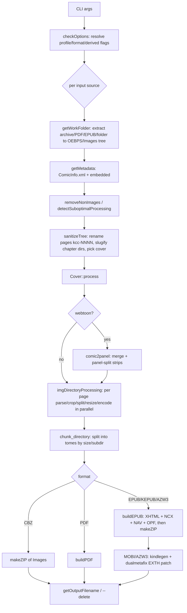

# AGENTS.md — Porting KCC's comic-to-ebook CLI to Rust (`comic-book ebook`)

This document is the game plan for porting the **command-line** comic→ebook converter from
KCC (Kindle Comic Converter, the Python project under `kcc/`) into this Rust workspace as a
new subcommand: **`comic-book ebook`**.

It is written to be executed incrementally by coding agents. Each phase has a concrete
deliverable and exit criteria. Keep this file updated as decisions are made.

---

## 1. Objective

Add a self-contained, cross-platform `comic-book ebook` command that converts comic book
archives into e-book formats:

- **Inputs:** `.cbz`/`.zip`, `.cbr`/`.rar`, `.cb7`/`.7z`, `.cbt`/`.tar`, image folders,
  and (secondary) `.epub` and `.pdf`.
- **Outputs:** `epub`, `kepub` (Kobo `.kepub.epub`), `azw3` / `mobi` (Kindle), plus
  `cbz`, `pdf`, and `kfx`-as-EPUB presets.
- **No external programs required.** No `7z`, `unrar`, `unar`, `kindlegen`, `mozjpeg`,
  ImageMagick, etc. Everything must be compiled into the binary (native Rust crates, or
  crates that vendor/compile their C dependencies).
- **No GUI, no Kindle-device detection/upload.**

The Python code is a **guide, not a specification**. Where Rust offers a materially better
approach for memory, CPU, or I/O, take it (see §5). Where KCC's *output document format* is
device-sensitive, reproduce it faithfully (see §5.2).

---

## 2. Scope

### In scope
- `kcc/kcc-c2e.py` pipeline and the modules it uses:
  `comic2ebook.py`, `comicarchive.py`, `image.py`, `color.py`, `page_number_crop_alg.py`,
  `inter_panel_crop_alg.py`, `common_crop.py`, `rainbow_artifacts_eraser.py`,
  `metadata.py`, `shared.py`, `comic2panel.py`, `pdfjpgextract.py`, `kindle.py` (device I/O
  excluded), `dualmetafix.py` (replaced — see §9).
- All `kcc-c2e` CLI options, re-expressed as `comic-book ebook` flags (§4).
- All output formats listed above.
- Feature fusion, multi-tome splitting, webtoon, panel view, smart cover crop, cropping,
  autocontrast/autolevel, moiré eraser, metadata via `ComicInfo.xml`.

### Out of scope
- `kcc.py`, `KCC_gui.py`, `KCC_ui*.py`, `KCC_rc.py`, `KCC_spread_label.py` (Qt GUI).
- `startup.py` GUI/dependency checks.
- Kindle device mounting, thumbnail upload (`kindle.py` device paths), `sent to Kindle`.
- Running/reading requiring `kindlegen`, `7`-Zip, `unar`, `unrar`, PyMuPDF, Pillow, numpy, Qt.
- `kcc-c2p.py` as a standalone command (its `comic2panel` logic is folded into `--webtoon`).

---

## 3. Reference: how KCC's `c2e` pipeline works

Read `kcc/kindlecomicconverter/comic2ebook.py` alongside this section.



Key behaviors to preserve (details in later sections):

- Work happens in a temp dir laid out as `<tmp>/OEBPS/Images/<chapter>/<page>`.
- Pages are renamed to `kcc-0001.ext` … (`sanitizeTree`), with an order suffix
  `-kcc-x` (normal), `-kcc-a`/`-kcc-d` (rotated spreads), `-kcc-b`/`-kcc-c` (split
  halves). Kindle Scribe output splits tall pages into `…-above`/`…-below`.
- Chapter directory names are slugified (ASCII, zero-padded numbers) for EPUB.
- Cover is either the first page, a `Covers/` sibling image, or a fused cover; optionally
  auto-cropped from a wide spread (`smartcovercrop`).
- Processing is parallel (Python `multiprocessing`), then the whole thing is zipped
  (`mimetype` first + stored, rest deflated) for EPUB.
- Default profile `KV`; default format `Auto` (→ MOBI for Kindle profiles, PDF for
  reMarkable, else EPUB).

### 3.1 Component → responsibility map

| KCC module | Responsibility | Rust home (§6) |
|:---|:---|:---|
| `comic2ebook.py` | Orchestration, CLI, EPUB/PDF building, chunking, fusion | `ebook/mod.rs`, `ebook/cli.rs`, `ebook/output/*`, `ebook/chunk.rs` |
| `comicarchive.py` | Archive detection/extraction via external tools | replaced by `crate::archive` (`ebook/input/archive.rs`) |
| `image.py` | `ProfileData`, `ComicPageParser`, `ComicPage`, `Cover` | `ebook/profiles.rs`, `ebook/processing/*` |
| `color.py` | Color vs. grayscale decision | `ebook/processing/color.rs` |
| `page_number_crop_alg.py` | Margin + page-number crop bbox | `ebook/processing/crop.rs` |
| `inter_panel_crop_alg.py` | Crop empty gutters between panels | `ebook/processing/interpanel.rs` |
| `common_crop.py` | Threshold/grouping helpers | `ebook/processing/crop.rs` |
| `rainbow_artifacts_eraser.py` | Moiré removal via FFT (color e-ink) | `ebook/processing/rainbow.rs` |
| `metadata.py` | `ComicInfo.xml` parse/write | `ebook/metadata.rs` |
| `shared.py` | Image ext helper, natural sort, tree walk | `ebook/model.rs`, `crate` utils |
| `comic2panel.py` | Webtoon merge + panel splitting | `ebook/processing/webtoon.rs` |
| `pdfjpgextract.py` | Legacy JPEG-in-PDF extraction | `ebook/input/pdf.rs` |
| `dualmetafix.py` | Patch MOBI EXTH (EBOK/ASIN) | replaced by `kindling` (§9) |
| `kindle.py` | Device detection/upload | **excluded** |

---

## 4. Target CLI

### 4.1 Shape

```text
comic-book ebook [OPTIONS] <INPUT>...

Inputs:
  One or more comic archives (.cbz/.cbr/.cb7/.cbt/.zip/.rar/.7z/.tar), image folders,
  or (secondary) .epub/.pdf files. A folder containing comics is expanded.
```

`clap` derive with grouped `#[command(flatten)]` structs mirroring KCC's option groups:
**Device**, **Main**, **Processing**, **Output**, **Custom profile**.

### 4.2 Option map (`kcc-c2e` → `comic-book ebook`)

Rename for clarity; keep semantics. Grouped to match KCC's parser groups.

**Device / Profile**
| KCC flag | New flag | Notes |
|:---|:---|:---|
| `-p/--profile` | `-p/--profile` | default `KV`; see §12.1 |
| `--customwidth` | `--custom-width` | override profile width |
| `--customheight` | `--custom-height` | override profile height |

**Main**
| KCC flag | New flag | Notes |
|:---|:---|:---|
| `-m/--manga-style` | `-m/--manga` | RTL reading/splitting |
| `--lightnovel` | `--light-novel` | resize only, preserve structure, output CBZ/EPUB |
| `--wallpaper` | `--wallpaper` | crop to fill screen |
| `--invertdirection` | `--invert-direction` | invert page-turn direction |
| `-q/--hq` | `-q/--hq` | higher-res panel view |
| `-2/--two-panel` | `-2/--two-panel` | 2-panel (not 4) panel view |
| `--vertical4panel` | `--vertical-4-panel` | side panels first |
| `--legacypanelview` | `--legacy-panel-view` | legacy panel view |
| `-w/--webtoon` | `-w/--webtoon` | webtoon mode |
| `--ts/--targetsize` | `--target-size <MB>` | max output size |
| `--filefusion` | `--file-fusion` | combine inputs into one book |

**Processing**
| KCC flag | New flag | Notes |
|:---|:---|:---|
| `-n/--noprocessing` | `-n/--no-processing` | pass pages through untouched |
| `-r/--splitter` | `-r/--splitter <0\|1\|2>` | 0 split, 1 rotate, 2 both |
| `-g/--gamma` | `-g/--gamma <float>` | gamma correction (auto when 0) |
| `-c/--cropping` | `-c/--cropping <0\|1\|2>` | 0 off, 1 margins, 2 margins+page numbers |
| `--cp/--croppingpower` | `--cropping-power <float>` | |
| `--cm/--croppingminimum` | `--cropping-minimum <float>` | |
| `--preservemargin` | `--preserve-margin <int>` | |
| `--ipc/--interpanelcrop` | `--inter-panel-crop <0\|1\|2>` | |
| `--blackborders`/`--whiteborders` | `--black-borders`/`--white-borders` | |
| `--forcecolor` | `--force-color` | do not grayscale |
| `--forcepng` | `--force-png` | PNG for B/W pages |
| `--force-png-rgb` | `--force-png-rgb` | color pages as PNG |
| `--webp` | `--webp` | lossy/lossless WebP output |
| `--noquantize` | `--no-quantize` | |
| `--pnglegacy` | `--png-legacy` | 8-bit PNG (legacy devices) |
| `--jpeg-quality` | `--jpeg-quality <0-95>` | default 85 (90 for KS/KCS) |
| `--maximizestrips` | `--maximize-strips` | 1×4 → 2×2 strips |
| `--autolevel` | `--auto-level` | |
| `--noautocontrast` | `--no-autocontrast` | |
| `--colorautocontrast` | `--color-autocontrast` | |
| `--eraserainbow` | `--erase-rainbow` | moiré filter |
| `--smartcovercrop` | `--smart-cover-crop` | |
| `--coverfill` | `--cover-fill` | crop cover to fill |
| `-u/--upscale` | `-u/--upscale` | |
| `-s/--stretch` | `-s/--stretch` | |
| `--norotate` | `--no-rotate` | |
| `--rotateright` | `--rotate-right` | |
| `--rotatefirst` | `--rotate-first` | |
| `--legacyextract` | `--legacy-extract` | PDF/EPUB legacy image extraction |
| `--pdfwidth` | `--pdf-width` | render vector PDFs to width |
| `-d/--delete` | `-d/--delete` | delete source after success |
| `--tempdir` | `--temp-dir` | spool temp files on source drive |
| `--mozjpeg` | *(dropped or mapped)* | optional; see §7 |

**Output**
| KCC flag | New flag | Notes |
|:---|:---|:---|
| `-o/--output` | `-o/--output <path>` | output dir or filename |
| `-t/--title` | `-t/--title <str>` | default = source name |
| `--metadatatitle` | `--metadata-title <0\|1\|2>` | |
| `--keepcomicinfo` | `--keep-comicinfo` | keep original ComicInfo.xml (CBZ) |
| `-a/--author` | `-a/--author <str>` | default = ComicInfo / `KCC` |
| `--language` | `--language <bcp47>` | default `en-US` |
| `-f/--format` | `-f/--format <FMT>` | see §4.3 |
| `--nokepub` | `--no-kepub` | `.epub` instead of `.kepub.epub` |
| `-b/--batchsplit` | `-b/--batch-split <0\|1\|2>` | |
| `--spreadshift` | `--spread-shift` | |
| `--onepagelandscape` | `--one-page-landscape` | |
| `--ebok` | `--doc-type <ebok\|pdoc\|none>` | replaces `--ebok` boolean; see §9 |

**Other**
| KCC flag | New flag |
|:---|:---|
| `-h/--help` | `-h/--help` (clap) |

### 4.3 Formats

`-f/--format` value set (KCC's, minus device-only behaviors):

| Value | Meaning |
|:---|:---|
| `auto` | pick by profile (MOBI for Kindle, PDF for reMarkable, else EPUB) |
| `epub` | fixed-layout EPUB 3 |
| `kepub` | KePub (EPUB with `.kepub.epub` + Kobo spread properties) |
| `azw3` | KF8-only Kindle file |
| `mobi` | dual MOBI7+KF8 `.mobi` (legacy devices) |
| `mobi+epub` | keep the intermediate EPUB alongside the MOBI |
| `cbz` | repackage images (no EPUB) |
| `pdf` | PDF |
| `kfx` | EPub preset for Calibre KFX Output plugin (KCC behavior) |
| `epub-200mb` / `pdf-200mb` / `mobi+epub-200mb` | size-capped presets (→ target_size 195 MB, batch split) |

---

## 5. Design decisions and deviations from KCC

### 5.1 Implementation optimizations (do these)

1. **No double temp tree.** KCC extracts to `<tmp>/OEBPS/Images`, copies again for fusion,
   and uses `multiprocessing` (pickling options per task). Design the Rust pipeline around
   an in-memory `ComicTree` (chapters → pages), streaming from the source archive.
   - Default: keep decoded/processed pages in memory with a configurable spool fallback
     (`--temp-dir`, or automatic spill above a byte budget).
   - This removes at minimum one full copy of every page image.
2. **Parallelism via `rayon`** over pages (CPU-bound image work), with a bounded pool sized
   to cores. No process spawning, no pickling.
3. **Stream output.** Write the EPUB zip as pages finish: `mimetype` first (stored), then
   images, then derived XHTML/NCX/NAV/OPF once dimensions are known. Reuse one scratch
   buffer per worker.
4. **Reuse existing SIMD resizing** (`fast_image_resize`) and the existing archive
   reader/writer stack (`src/archive`) instead of shelling out.
5. **Skip work when possible:** `--no-processing` copies original bytes; already-small
   images skip resampling; a page within the target profile that needs no transform and no
   format change is emitted byte-for-byte.
6. **Bound memory per page** and process chapter-by-chapter; never hold two full decode
   buffers plus an encode buffer unnecessarily (see §14).

### 5.2 Output fidelity (do NOT casually change)

The fixed-layout XHTML/OPF/NCX/NAV that KCC emits and the MOBI that `kindlegen` produced are
**device-sensitive**. Reproduce their *structure and semantics* (element names, attributes,
viewport meta, spread properties, EXTH/`doc-type` behavior). Optimize the *code that builds
them*, not the document format. Any intentional deviation must be called out and tested.

### 5.3 Prefer off-the-shelf solutions — do not reinvent the wheel

This repo has to stay **maintainable**. Code we write, we own: we have to debug it, test it,
keep it correct as inputs change, and carry it forever. A maintained crate is somebody
else's problem, is battle-tested in the wild, and can be upgraded. **Default to an existing
library; only write our own implementation when there is a concrete reason that a library
cannot be used.** This is a hard default, not a suggestion.

Before hand-rolling anything, check (in order):

1. Does an existing dependency (§7 *Existing*) already do it? Reuse it rather than adding a
   new crate or writing code.
2. Does a maintained, well-licensed crate do it? Prefer it, even if the API is not a perfect
   fit — a thin adapter is cheaper to own than the algorithm.
3. Only then write bespoke code, and say why in the PR/commit: no suitable crate exists, the
   crate is unmaintained or incompatible with §7's licence/self-contained rules, its output
   cannot be pinned to KCC's format (§5.2), or the need is genuinely trivial (a few lines).

The clean-room requirement (§5.4) is *not* a licence to hand-roll: it means we must not copy
KCC's GPL source, not that we must avoid libraries. Where a crate can supply the behaviour,
use the crate. **Phase R** (§15) tracks the concrete follow-ups of applying this retroactively
to code already committed.

Decisions already taken under this policy:

- **MOBI/AZW3 encoding → `kindling-mobi`** (MIT, pure Rust, cross-platform, explicitly a
  kindlegen replacement with comic/fixed-layout support). Replaces `kindlegen` +
  `dualmetafix` + tool detection. **Decision (see §13.1/§13.2): `kindling` is an accepted
  hard dependency; we do not shell out to any external tool or sister binary.**
- **Image primitives → `image`, `fast_image_resize`, `imageproc`, `quantette`, `png`,
  `rustfft`** rather than bespoke pixel loops (Phases 2–3, §7).
- **EPUB/KEPUB packaging** → hand-written for now. This is the one place we do own the writer,
  because the emitted layout must match KCC byte-for-byte-ish (§5.2) and no crate offers
  that control; if a suitable crate appears, prefer it. Even here, use a zip writer
  (`zip`/`flate2`) and an XML writer (`quick-xml`) rather than hand-assembling bytes.
  **Update (Phase 6):** the document *skeletons* (OPF/NCX/NAV/XHTML/`style.css`) are now
  rendered from `askama` templates instead of `push_str` chains; the packaging itself is
  still ours, and the byte-for-byte output is unchanged (§13.10).

### 5.4 Clean-room re-implementation of KCC behaviour (do NOT copy source)

KCC is distributed under ISC, but `image.py` and `dualmetafix.py` carry GPL-3 headers
(derived from earlier GPL sources), which is incompatible with this repo's MIT licence.
The corresponding behaviour will therefore be **re-implemented from scratch** from the
documented behaviour and observable outputs — never transliterated from KCC source:

- `image.py` → `ebook/processing/*` (`ComicPageParser`, `ComicPage`, `Cover`, and the crop/
  split/color/fill algorithms). Implement each algorithm from its spec (thresholds, order of
  operations, geometry) and validate against fixtures.
- `dualmetafix.py` → **not ported at all.** MOBI/AZW3 encoding *and* its EXTH/doc-type/ASIN
  handling are provided by the MIT `kindling` crate (§9).

Contributors must not paste GPL code, comments, or identifiers from those files into this
repo. When in doubt, write the implementation from the described behaviour and a test that
pins it.

### 5.5 Attribution and licence compliance

This repo ships under the **MIT** licence (`LICENSE`). The `comic-book ebook` command is an
independent, clean-room reimplementation of KCC's `kcc-c2e` behaviour (§5.4): no KCC source
is copied into this repo, and MOBI/AZW3 encoding is delegated to the separate MIT
`kindling` crate (§9).

KCC itself (Kindle Comic Converter) is distributed under the **ISC** licence, which permits
reuse provided its copyright and permission notice is retained in all copies and
substantial portions. Even though we reimplement rather than copy, the design is derived
from studying KCC and the emitted document formats (§5.2) intentionally match it, so we
honour KCC's notice:

- Keep the notice below alongside the project (README and/or a `NOTICE` / `ATTRIBUTIONS`
  file) and in any distribution that ships the KCC-derived pipeline or format-compatible
  output.
- Never copy from `image.py` / `dualmetafix.py`, which carry GPL-3 headers — see §5.4.
- Third-party dependencies keep their own licences; verify each new crate's licence before
  adding it (§7, §18).

KCC's licence notice (`kcc/LICENSE.txt`), reproduced verbatim:

```text
ISC LICENSE

Copyright (c) 2012-2025 Ciro Mattia Gonano <ciromattia@gmail.com>
Copyright (c) 2013-2019 Paweł Jastrzębski <pawelj@iosphe.re>
Copyright (c) 2021-2023 Darodi (https://github.com/darodi)
Copyright (c) 2023-2025 Alex Xu (https://github.com/axu2)

Permission to use, copy, modify, and/or distribute this software for
any purpose with or without fee is hereby granted, provided that the
above copyright notice and this permission notice appear in all
copies.

THE SOFTWARE IS PROVIDED "AS IS" AND THE AUTHOR DISCLAIMS ALL
WARRANTIES WITH REGARD TO THIS SOFTWARE INCLUDING ALL IMPLIED
WARRANTIES OF MERCHANTABILITY AND FITNESS. IN NO EVENT SHALL THE
AUTHOR BE LIABLE FOR ANY SPECIAL, DIRECT, INDIRECT, OR CONSEQUENTIAL
DAMAGES OR ANY DAMAGES WHATSOEVER RESULTING FROM LOSS OF USE, DATA
OR PROFITS, WHETHER IN AN ACTION OF CONTRACT, NEGLIGENCE OR OTHER
TORTIOUS ACTION, ARISING OUT OF OR IN CONNECTION WITH THE USE OR
PERFORMANCE OF THIS SOFTWARE.
```

---

## 6. Proposed Rust module architecture

```text
src/
  lib.rs                      # add `pub mod ebook;`
  cli.rs                      # add `Ebook { .. }` subcommand; dispatch to ebook::run
  ebook/
    mod.rs                    # run_ebook(); orchestration (makeBook equivalent)
    cli.rs                    # clap structs for all option groups
    options.rs                # resolved Options + checkOptions() equivalent
    profiles.rs               # ProfileData: Kindle/Kobo/reMarkable/OTHER + palettes
    model.rs                  # ComicTree, Chapter, Page, PageFlags, naming helpers
    metadata.rs               # ComicInfo.xml parse + metadata resolution
    naming.rs                 # slugify, sanitize/naming, getOutputFilename
    chunk.rs                  # target-size / batch-split tome keeper
    progress.rs               # indicatif reporting (headless-safe)
    input/
      mod.rs                  # ComicSource detection + dispatch
      archive.rs              # cbz/cbr/cb7/cbt/dir via crate::archive
      epub.rs                 # EPUB input (spine-ordered images)
      pdf.rs                  # PDF input (extract/render) + legacy JPEG scan
      fusion.rs               # --file-fusion
    processing/
      mod.rs                  # process tree in parallel; produce EncodedPage
      color.rs                # colorCheck
      fill.rs                 # fillCheck (page background)
      crop.rs                 # margins + page-number crop, threshold/group helpers
      interpanel.rs           # inter-panel crop
      rainbow.rs              # FFT moiré eraser
      page.rs                 # ComicPage: gamma/autocontrast/autolevel/resize/encode
      cover.rs                # Cover: process, smart cover crop (tome label: Phase 9)
      webtoon.rs              # comic2panel: merge + panel split
    output/
      mod.rs                  # dispatch by Format; filename resolution; --delete
      epub/
        mod.rs                # buildEPUB driver
        templates.rs          # askama view structs for the generated documents
        xhtml.rs              # buildHTML (+ Panel View)
        nav.rs                # buildNCX / buildNAV
        opf.rs                # buildOPF (spread logic, kindle meta)
        package.rs            # OEBPS layout + EPUB zip (mimetype first)
      kepub.rs                # KEPUB variant (extension + Kobo properties)
      cbz.rs                  # CBZ output (reuse archive writer)
      pdf.rs                  # buildPDF
      kindle.rs               # kindling integration: azw3 / mobi / mobi+epub
```

Reuse (no change): `crate::archive` (`detect_archive_kind`, `ArchiveReader`,
`ArchiveWriter`), `crate::image_ops` (resize/encode helpers), `crate::clamp` patterns
(`remove_dir_all_force`).

The generated document *skeletons* (`page.xhtml`, `content.opf`, `toc.ncx`, `nav.xhtml`,
`style.css`) live in the crate-root `templates/` directory and are pulled in by askama's
`path = "…"`, so they are compiled into the binary — there is no runtime template file.
See §13.10.

---

## 7. Dependencies

**Policy (§5.3):** before writing new code, check this table and crates.io — prefer an
existing maintained crate over a hand-rolled implementation, and reuse an already-present
dependency over adding a new one.

Existing (reuse): `clap`, `clap_complete`, `image`, `zip`, `tar`, `sevenz-rust2`, `unrar`,
`rars`, `rayon`, `indicatif`, `natord`, `anyhow`, `tempfile`, `fast_image_resize`, `webp`,
`walkdir`, `same-file`, `infer`.

Add (verify licenses; prefer pure Rust):

| Crate | Purpose | License note |
|:---|:---|:---|
| `kindling-mobi` (lib `kindling`) | EPUB/OPF → AZW3/MOBI | MIT (compatible) |
| `quick-xml` | ComicInfo/EPUB/OPF parse + write | MIT/Apache |
| `askama` | EPUB/KePub XHTML/OPF/NCX/NAV + `style.css` document skeletons | MIT/Apache, pure Rust, compile-time |
| `uuid` | EPUB `dc:identifier` urn:uuid | MIT/Apache |
| `time` or `chrono` | `dcterms:modified` timestamp | MIT/Apache |
| `ndarray` | array math for crop/webtoon | MIT/Apache |
| `imageproc` | grayscale/box-blur/edges/draw text | MIT |
| `quantette` | fixed-palette quantisation + Floyd–Steinberg dithering | MIT/Apache |
| `png` (direct) | indexed/palette PNG output (`image` cannot write indexed PNG) | MIT/Apache |
| `rustfft` | moiré FFT (`rainbow_artifacts_eraser`) | MIT/Apache |
| `ab_glyph` (via imageproc) | tome-number cover text (deferred to Phase 9; §13.11.4) | MIT/Apache |
| `slug` or small custom fn | chapter slugify parity with python-slugify | MIT/Apache |
| `lopdf` and/or `pdf-render`/`pdfboss-render` | PDF input (extract/render), pure Rust | verify |
| `printpdf` or `pdf-writer` | PDF output | MIT |
| `flate2` | EPUB deflate (likely already transitive) | MIT/Apache |

Avoid: `boko` (GPL-3.0-or-later — incompatible with this MIT project's dependency policy),
`pdfium-render`/`mupdf` unless a bundled build is acceptable (they pull platform binaries).
`--mozjpeg`: either drop, or use a pure-Rust/`mozjpeg` crate; default to the `image` JPEG
encoder with `--jpeg-quality`.

**Added in Phase 2.** `imageproc = "0.27"` (`default-features = false, features = ["rayon"]`),
`quantette = "0.6"` (`default-features = false, features = ["image", "threads"]`) and
`png = "0.18"`. `imageproc`'s default features are disabled so it does not turn on `image`'s
default codecs (avif/exr/…); `quantette`'s `kmeans` default is disabled because only its
`CustomPalette` path is used.

**Added in Phase 3.** `rustfft = "6"` (MIT/Apache-2.0, pure Rust) for the `--erase-rainbow`
moiré eraser. **No font dependency was taken in Phase 6:** `ab_glyph` (for the tome `N/M`
cover label) is deferred to Phase 9 along with chunking, because the label is unreachable
until a source splits into multiple tomes and no pure-Rust crate ships a font asset (§13.11.4).

**Added in Phase R.** `bitvec = "1"` (MIT, pure Rust) for the sub-byte scanline packing in
`page.rs::pack_indices`. It was already in the tree transitively via `quantette`; Phase R
promoted it to a direct dependency rather than keep the hand-rolled shifting. No other new
dependency was taken: the remaining Phase R swaps either use a crate already present
(`image`, `imageproc`) or std (`f64::round_ties_even`). The `remove_dir_all`/`dircpy`/
`thousands` candidates were deliberately not adopted (see §15 Phase R and §13.7).

**Added in Phase 4.** `quick-xml = "0.37"` (MIT, pure Rust) for `ComicInfo.xml` parsing;
`slug = "0.1"` (MIT, pulls `deunicode`) for chapter-directory slugification; and `regex =
"1"` (MIT, already in the tree transitively via `unrar`) for KCC's two number-padding
substitutions and its `\W+` Kobo filename rule. No crate reproduces `python-slugify`'s
option set, so `slug` supplies the transliteration/collapse step and the KCC-specific
padding is layered on top (§13.8.1).

**Added in Phase 5.** `uuid = { version = "1", features = ["v4"] }` (MIT/Apache-2.0) for the
EPUB `dc:identifier`/`dtb:uid` and `time = { version = "0.3", features = ["formatting",
"macros"] }` (MIT/Apache-2.0, pure Rust) for `dcterms:modified`, both from §7's candidate
table (§13.9.5). `zip` was re-declared as a dev-dependency so the Phase 5 tests can read the
EPUB container back.

**Added in Phase 6.** `askama = { version = "0.16", default-features = false, features =
["config", "derive", "std"] }` (MIT OR Apache-2.0, pure Rust) renders the generated
document skeletons (§13.10). `config` is also what enables askama's `external-sources`, i.e.
the `path = "…"` template files; those extra crates are proc-macro/build-time only, so the
runtime dependency added to the binary is just `itoa`.

**Licence — decided (§13.1).** The KCC repo is distributed under ISC (`kcc/LICENSE.txt`),
but `kcc/kindlecomicconverter/image.py` and `dualmetafix.py` retain GPL-3 headers (they
derive from earlier GPL sources). `image.py` is the source of `ComicPage`/`Cover`.
Resolution: **clean-room re-implement** the behaviour with no source copied (see §5.4), and
use the MIT `kindling` crate for the MOBI side so `dualmetafix` is never ported. Do **not**
transliterate GPL source.

---

## 8. Feature-by-feature port map

| KCC function | Rust approach | Priority |
|:---|:---|:---|
| `checkOptions` | `Options::resolve` — derive `iskindle`/`isKobo`, `kindle_azw3`, defaults, format presets, panel-view gating, webtoon mandate, custom profile | P0 |
| `getWorkFolder` | `input/*` adapters producing a `ComicTree` | P0 |
| `getMetadata` | `metadata.rs` — parse ComicInfo, title/authors/series resolution | P0 |
| `removeNonImages` | drop non-image pages while building the tree | P0 |
| `sanitizeTree` + `slugify` | `naming.rs` — deterministic page names, chapter slugs, cover pick | P0 |
| `ComicPageParser` | `processing/page.rs` + `color.rs` + `fill.rs` + `crop.rs` + `interpanel.rs` | P0 |
| `ComicPage` (gamma/contrast/level/grayscale/quantize/resize/encode) | `processing/page.rs` | P0 |
| `Cover` | `processing/cover.rs` | P0 |
| `buildHTML` | `output/epub/xhtml.rs` | P0 |
| `buildNCX`/`buildNAV` | `output/epub/nav.rs` | P0 |
| `buildOPF` | `output/epub/opf.rs` | P0 |
| `buildEPUB` | `output/epub/mod.rs` | P0 |
| `makeZIP` | `output/epub/package.rs` (+ existing `ArchiveWriter` for CBZ) | P0 |
| `getOutputFilename` | `naming.rs` (Kobo/`.kepub.epub`, `_kcc<N>` collision) | P0 |
| `detectSuboptimalProcessing` | `processing/mod.rs` warnings (already-processed; small images) | P1 |
| `chunk_directory`/`chunk_process`/`createNewTome` | `chunk.rs` | P1 |
| `makeFusion` | `input/fusion.rs` | P1 |
| `comic2panel.main` (webtoon) | `processing/webtoon.rs` | P1 |
| `color.py` | `processing/color.rs` | P0 |
| `page_number_crop_alg.py` | `processing/crop.rs` | P1 |
| `inter_panel_crop_alg.py` | `processing/interpanel.rs` | P2 |
| `rainbow_artifacts_eraser.py` | `processing/rainbow.rs` | P2 |
| `buildPDF` | `output/pdf.rs` | P2 |
| PDF input (`getWorkFolder` branch, `pdfjpgextract`) | `input/pdf.rs` | P1 (extract), P2 (render) |
| EPUB input branch | `input/epub.rs` | P1 |
| `makeMOBI`/`makeMOBIFix`/`dualmetafix` | `output/kindle.rs` via `kindling` | P1 |
| `lightnovel` path | `output/mod.rs` resize-and-repackage branch | P1 |
| `--wallpaper` | `processing/page.rs` (fit crop) | P1 |
| kindle device upload | **excluded** | — |

---

## 9. Kindle output plan (AZW3/MOBI) without kindlegen

KCC's MOBI path = build fixed-layout EPUB → run `kindlegen` → `dualmetafix` patches EXTH
(`501`=EBOK/PDOC, `113`=ASIN). We replace all of that with **`kindling`**.

> **Decision (§13.2):** `kindling-mobi` is an accepted dependency. It is MIT-licensed and
> pure Rust, so it satisfies the "no external programs" rule and does not introduce a GPL
> obligation. `dualmetafix` is therefore **not ported** (see §5.4).

1. Build the same fixed-layout EPUB we would for `-f epub`.
2. Call `kindling`'s library API to encode:
   - `azw3` → KF8-only `.azw3` (default; modern Kindles).
   - `mobi` → legacy dual MOBI7+KF8 `.mobi` (for old devices + sideloaded library covers).
3. Map `--doc-type ebok|pdoc|none` onto kindling's `doc-type` (default `none` to avoid the
   documented firmware "back-to-library" issue). Cover/thumbnail handled by kindling.
4. `mobi+epub` → keep the intermediate `.epub` as well.

Risks/verification: confirm the exact `kindling` public API (build from EPUB path or bytes),
fixed-layout handling, and whether it can consume our OPF metadata. If it cannot, fall back
to (a) driving it as a *bundled* library path only, or (b) a minimal native KF8 writer as a
last resort (large — treat as a stretch task, see §11.9).

KFX: KCC outputs an EPUB meant for Calibre's KFX plugin. Reproduce that preset (EPUB with
KFX-oriented flags) — no KFX encoder needed.

---

## 10. Data model

```rust
struct ComicTree {
    chapters: Vec<Chapter>,
    cover: Option<CoverSource>,
    comicinfo: Option<Vec<u8>>,     // raw discovered ComicInfo.xml, if any
}
struct Chapter { name: String, pages: Vec<Page> }  // name = image-root-relative dir path ("" = root)
struct Page {
    source_name: String,          // book-relative source path (root dir stripped)
    rel_path: String,             // chapter-relative file name
    image: DynamicImage,          // decoded (dimensions + pixels)
    background: Background,       // White | Black
    flags: PageFlags,             // Rotated, BlackBackground, Above/Below, OrderClass
    raw: Option<Vec<u8>>,         // original encoded bytes (retained for --no-processing)
    source_media_type: Option<MediaType>,
}
enum Background { White, Black }
enum OrderClass { Normal, RotateFirst, RotateLast, SplitLeft, SplitRight }
enum MediaType { Jpeg, Png, Gif, WebP }

struct EncodedPage {              // one processed/encoded page (a spread can yield several)
    name: String,                 // stem + `-kcc-<order>` + extension (slugified in Phase 4)
    order_class: OrderClass,
    media_type: MediaType,
    bytes: Vec<u8>,
    width: u32,
    height: u32,
    flags: PageFlags,
}
```

`Chapter::name` is the directory path relative to the image root (`""` for pages that sit
directly in the root, `"Chapter 1"`, `"Chapter 1/Sub"`, …); output slugifies each path
component. `Page::source_name` is the path within the book after an archive's redundant
single root directory has been stripped, so equivalent CBZ/folder inputs produce the same
value (see §13.4).

`processing` turns each `Page` into one or more `EncodedPage { name, bytes, width, height,
media_type, order_class, flags }`. The tree then feeds chunking and output builders.

Naming helper mirrors KCC suffixes: `-kcc-x`, `-kcc-a/-kcc-d`, `-kcc-b/-kcc-c`, and Scribe
`-above`/`-below` — these suffix strings are load-bearing for the OPF spread logic; keep them.

---

## 11. Algorithms to port (processing)

All operate on decoded RGB/RGBA/grayscale images.

1. **`colorCheck`** — convert to YCbCr, take Cb/Cr histograms, apply the cutoff/diff-threshold
   cascade `((0,0),22) → ((.2,.2),10) → ((3,3),4)`; shortcut for original mode `L`/`1`;
   always color in webtoon mode. `forcecolor` changes the precision test.
2. **`fillCheck`** — threshold ≤128 → 1-bit; compare black/white `getbbox` surface areas;
   if close, sample 5-px rows/columns via histogram to decide `white`/`black`. Returns page
   background; overridable by `--black-borders`/`--white-borders`.
3. **`splitCheck`** — decide `N` (normal), `R` (rotated spread), `S1`/`S2` (split halves)
   from aspect ratios vs. device ratio, `--splitter`, `--no-rotate`, `--rotate-right`,
   `--maximize-strips`, webtoon. `BISECT_THRESHOLD = 1.8`; split when `w/h > 1.16`.
4. **Cropping** — `get_bbox_crop_margin[_page_number]`: grayscale, optional invert
   (non-white bg), autocontrast(1), box blur(1), threshold `240 - power*64`, ignore pixels
   near edges, then page-number detection via row grouping + box merging
   (`merge_boxes`, `group_close_values`). Cap crop to 10 % per side; respect
   `--preserve-margin` and `--cropping-minimum`.
5. **Inter-panel crop** — find empty rows/columns (not near borders), keep 4 % gutter,
   delete those rows/cols.
6. **`ComicPage` pipeline** — order per KCC: gamma → grayscale (if B/W) → autocontrast
   (`preserve_tone`, skip if low-contrast: `max-min < 159`) → `autolevel` if requested →
   resize → moiré erase → quantize/convert → encode. Resize uses `contain`/`fit`/`pad`
   semantics with `BICUBIC` when down-scaling within profile and `LANCZOS` otherwise; KFX
   resolution handling; `stretch`/`wallpaper`/`upscale` paths.
7. **Encoding** — JPEG (quality), PNG (`forcepng`, lossless 1-bit-ish), GIF
   (Kindle Scribe B/W), WebP (`--webp`), with the same branch order as `save_with_codec`.
   Media types in OPF must match (`image/jpeg|png|gif|webp`).
8. **`Cover`** — autocontrast, optional grayscale, `smartcovercrop` (wide-spread heuristics),
   `thumbnail`/`fit` to profile, optional tome label `N/M` text (stroke width 25, size h/7;
   the label is deferred to Phase 9 — §13.11.4).
9. **Webtoon (`comic2panel`)** — merge chapter images vertically, detect panels via
   `FIND_EDGES` + threshold >6 + solid-row scanning, split over-long panels with overlap,
   repack into virtual pages at the device width/height (max width 1072).
10. **Moiré eraser** — RGB→YUV, FFT the luminance (`rustfft`), attenuate diagonal
    frequencies ≥0.30 cycles/px around 135°±10° (and perpendicular) by 0.10, inverse FFT,
    clip. Grayscale path operates on `L` directly.

---

## 12. Output document specs to reproduce

### 12.1 Profiles
Port the `ProfileData` tables verbatim (name, `(w,h)`, palette, gamma):
- **Kindle PDOC:** K1, K2, KDX, K34, K57, KPW, KV, KPW34, K810, KO, K11, KPW5, KPW6,
  KS1860, KS1920, KS1240, KS1324, KS, KCS, KS3, KSCS.
- **Kobo:** KoMT … KoE.
- **reMarkable:** Rmk1, Rmk2, RmkPP, RmkPPMove.
- **OTHER:** `(0,0)`.
- Palettes `Palette4/15/16`, `PalleteNull`.
`iskindle` = profile ∈ Kindle set; else `isKobo`. `KDX`+CBZ raises height to 1200;
Kindle Scribe caps width at 1920.

### 12.2 EPUB
Reproduce KCC's layout:
```
mimetype                     (stored, first)
META-INF/container.xml
OEBPS/Text/style.css
OEBPS/Text/**/*.xhtml        (one per page; Panel View divs when enabled)
OEBPS/Images/**              (cover.jpg + page images, chapters preserved)
OEBPS/toc.ncx
OEBPS/nav.xhtml
OEBPS/content.opf
```
- XHTML: `<!DOCTYPE html>`, `viewport` meta with width/height (÷1.5 when `--hq`), `img`
  with absolute `width`/`height`, `../` backrefs computed from the `Images` depth,
  `display:none` div for Kindle panel mode, and the `PV-*` panel-view divs.
- OPF: `package version="3.0"`, Dublin Core metadata, `dc:contributor` `KindleComicConverter-<ver>`,
  `belongs-to-collection`/`group-position` (series/volume/number, non-Kindle), `dcterms:modified`,
  `fixed-layout`/`original-resolution`/`book-type`/`primary-writing-mode`/`zero-gutter`/
  `zero-margin`/`ke-border-*`/`orientation-lock`/`region-mag` (Kindle), `rendition:spread`/
  `rendition:layout`, manifest items, and the `spine` with the spread-property algorithm
  (forward pass with `-kcc-a/b/c/d/x` specials, backward fix-up, `--spread-shift`,
  `--one-page-landscape`, `page-progression-direction`).
- `nav.xhtml` with `epub:type="toc"` and `page-list`.
- KEPUB: same, but extension `.kepub.epub` and `rendition:page-spread-*` properties
  (`isKobo` branch of `pageSpreadProperty`).

### 12.3 CBZ / PDF / light-novel
- CBZ: zip the processed `Images` tree; optionally keep `ComicInfo.xml`; cover as `##cover.jpg`
  when smart/custom cover applies.
- PDF: one page per image at native size, streamed, with title/author metadata.
- Light novel: resize-only, preserve structure, output CBZ (or EPUB passthrough).

---

## 13. Decisions and open questions

The two most consequential items are now **resolved** (§13.1); Phase 0 closed out several
smaller ones (§13.3). The rest remain open (§13.2).

### 13.1 Resolved

1. **Licence of `image.py`/`dualmetafix.py` (GPL-3 headers) vs. this repo's MIT — RESOLVED:
   clean-room.** The image-processing and MOBI-metadata behaviour will be **re-implemented
   from scratch** from documented behaviour and observable outputs, without transliterating
   KCC's `image.py` or `dualmetafix.py` source (see §5.4). MOBI/AZW3 encoding is handled by
   the MIT `kindling` crate, so `dualmetafix` is not ported at all. Contributors must not
   copy GPL code into this repo.
2. **`kindling` as a dependency — RESOLVED: adopt it.** `kindling-mobi` (MIT, pure Rust) is
   an accepted hard dependency for AZW3/MOBI output (§9). No sister tool and no subprocess;
   it is compiled into the binary.

### 13.2 Still open

3. **PDF input depth.** Start with embedded-JPEG extraction (pure Rust); decide whether to
   add a pure-Rust rasterizer for vector PDFs.
4. **Memory policy.** Default in-memory vs. spool-to-temp for large inputs; choose the
   spill budget and flag.
5. **`--mozjpeg` — RESOLVED in Phase 0 (§13.3.1).** Drop with a clear message; no mozjpeg
   encoder is bundled.
6. **KFX.** Confirm "EPUB preset only" (KCC behavior) is acceptable.
7. **Option naming.** Confirm the snake-case renames in §4.2, or preserve KCC spellings.
8. **Parity testing.** Approve committing KCC-generated reference EPUBs (from our own test
   content) for byte/structure comparison, or restrict to structural assertions.

### 13.3 Phase 0 decisions

1. **`--mozjpeg` — drop with a clear error.** The flag still parses (so KCC command lines
   don't silently change meaning) but `Options::resolve` rejects it with
   `--mozjpeg is not supported; use --jpeg-quality to control JPEG output`. No mozjpeg
   encoder (or `mozjpeg`-equivalent crate) is bundled; JPEG quality is governed solely by
   `--jpeg-quality`.
2. **`Profile` value names — exact KCC codes.** `clap::ValueEnum` for `Profile` is
   hand-implemented over `ALL_PROFILES`/`PROFILE_TABLE` so `--help`, errors and
   `shell completions` list the canonical codes (`KV`, `KoE`, `RmkPP`, `OTHER`) rather than
   heck-cased variants; `--profile` sets `ignore_case`, so any casing (e.g. `kv`) is accepted.
3. **`propagate_version`.** The root `Cli` enables `propagate_version = true`, so
   `comic-book ebook --version` works (a Phase 0 exit criterion). This also adds `-V` to the
   other subcommands.
4. **`--doc-type` replaces `--ebok` (§4.2).** Default `none`; `ebok`/`pdoc` select the
   EBOK/PDOC tag for Kindle output (§9). `Kepub`/`Azw3` are first-class `Format` values in
   addition to the KCC set.
5. **Exit codes.** `clap` command-line usage errors exit `2` (clap's default); any runtime
   error returned by the pipeline exits `1`. Documented in `src/ebook/mod.rs`.
6. **Gate hygiene.** Phase 0 also had to fix a pre-existing `clippy::manual_is_multiple_of`
   lint in `src/clamp.rs` to keep `clippy -D warnings` green under the current toolchain.
   No behaviour change.

### 13.4 Phase 1 decisions

1. **`ComicTree` gains a `comicinfo` field.** The loader retains the raw `ComicInfo.xml`
   bytes it discovers (rather than re-reading the source later), so `--keep-comicinfo` can
   round-trip it and the Phase 4 metadata pass parses on demand (§10).
2. **`Chapter::name` is the image-root-relative directory path** (`""` for the root chapter,
   `"Chapter 1/Sub"` for nested directories), and each page records its chapter-relative
   file name. This preserves arbitrarily nested chapter structure and lets Phase 4 slugify
   level by level, matching KCC's per-directory `sanitizeTree`.
3. **`Page::source_name` is book-relative.** KCC keeps the original archive entry, but the
   original differs between equivalent archive and folder inputs (an archive gets its single
   root folder flattened; a folder source is copied verbatim). Storing the post-strip path
   makes the two load into byte-identical trees, which is Phase 1's exit criterion.
4. **Archive-vs-folder flattening parity.** A single redundant root directory is stripped
   only for archive sources, matching KCC's `getWorkFolder` (folders keep their own layout
   because they are already relative to the selected directory). Fixtures that must load
   identically across formats therefore avoid a wrapper directory when the folder source is
   also compared.
5. **Junk filtering.** `._*`, `.DS_Store`, `Thumbs.db` and `__MACOSX/` entries are skipped
   before decoding (KCC's `dot_clean`), so AppleDouble sidecars never reach the image decoder.
6. **Image extensions follow KCC's `shared.IMAGE_TYPES` minus `.jp2`/`.avif`**
   (`.png/.jpg/.jpeg/.gif/.webp`) rather than the wider `image_ops::IMG_EXTENSIONS`, so
   `.bmp`/`.tiff` pages are dropped exactly as KCC drops them. `.jp2`/`.avif` have no decoder
   in the current pure-Rust dependency set, so they are ignored like any other non-image
   instead of aborting the conversion.
7. **Ordering is case-insensitive natural sort.** Pages within a chapter and sibling chapter
   directories are ordered with a component-wise natural comparison (`natord`), reproducing
   KCC's `walkSort`/`os_sorted` pre-order walk (`"" < "A" < "A/B" < "B"`).

---

### 13.5 Phase 2 decisions

1. **Original bytes are retained on `Page`.** Phase 1 already decoded every page into memory;
   `Page` now also keeps the source's encoded bytes and media type. This is what makes
   `--no-processing` a byte-for-byte copy (KCC skips processing entirely under `-n`, §5.1.5)
   and it costs only the compressed size, which is small next to the decoded pixels.
2. **Colour-space helpers are clean-room.** Pillow's JFIF YCbCr and Rec. 601 luma formulas are
   re-implemented in `color.rs` (AGENTS.md §5.4); `image`'s built-in grayscale uses Rec. 709,
   which would drift from KCC, so it is not used.
3. **Autocontrast is `imageproc::contrast::stretch_contrast`.** KCC calls
   `ImageOps.autocontrast(preserve_tone=True)` with `cutoff=0`, i.e. a linear stretch of each
   channel from the luminance minimum/maximum to `[0, 255]`. `stretch_contrast` is exactly
   that, and the low-contrast guard (`max - min < 159`) is applied first, as KCC does. The
   luma range is recomputed after `--auto-level` because Pillow's autocontrast uses the
   *current* histogram.
4. **Quantisation is `quantette` with Floyd–Steinberg.** `--force-png` on a grayscale page maps
   it onto the profile palette (a grayscale ramp) using `QuantizeMethod::CustomPalette` +
   `dither::FloydSteinberg`, matching `PIL.Image.quantize(palette=…)`, which also dithers by
   default. Distance is computed in Oklab rather than RGB (quantette's choice); for the
   grayscale ramps used here that is equivalent up to rounding.
5. **Palette PNGs are written by the `png` crate** at the smallest bit depth the palette fits
   in (4-bit for the 16-level palettes), reproducing KCC's non-legacy PNG. `--png-legacy`, PDF
   and KDX-CBZ first reduce the quantised page to 8-bit grayscale, as KCC does.
6. **`image`'s GIF encoder needs RGB.** Monochrome Kindle pages (`--force-png` on a Kindle
   profile) are encoded as GIF; because `image`'s GIF encoder rejects L8, the page is widened
   to RGB first (GIF is palette-based anyway).
7. **`--wallpaper` implements the intended fit.** KCC 9.x's `resizeImage` has an unreachable
   `elif self.opt.wallpaper: ImageOps.fit(...)` after a bare `pass` for the same condition, so
   wallpaper mode currently leaves the page unsized. We implement the documented intent (crop
   to fill the screen). Flagged as a deliberate, tested deviation from the reference code.
8. **`kfx` resize is deferred.** KCC's KFX branch resizes to the inputs' most common
   resolution, which requires scanning sources in `checkOptions`; Phase 5 implemented the KFX
   *preset* (EPUB with `region-mag=false`) but not the resolution override, which is still
   open — see §13.9.6. Until then `--format kfx` falls through the normal resize chain.
9. **`--no-processing` media types are preserved.** Pages are emitted with their source
   extension/media type and `OrderClass::Normal` (no splitting), since processing is skipped
   wholesale in KCC too.

### 13.6 Phase 3 decisions

1. **Cropping runs in `prepare_page`, before the splitter.** KCC crops in
   `ComicPageParser.__init__`, i.e. before `splitCheck`, on the original page; the port
   mirrors that so the splitter and encoder see the cropped page. Cropping lives in the new
   `processing::prepare_page` (which also owns `fillCheck`) rather than inside
   `page::process_page`, so the Phase 2 unit tests that call `process_page` directly are
   unaffected. End-to-end behaviour is pinned by `tests/ebook_crop_tests.rs`.
2. **Cropping is skipped in webtoon mode and for a colour first page.** KCC wraps the whole
   crop block in `if is_first_page and colorCheck(...): pass else: …`, which is what keeps a
   colour cover intact. `prepare_page` reproduces that decision via `color::color_check`
   (reusing `page::is_grayscale_image` for the `L`/`1` shortcut); the first page is the first
   page of the first non-empty chapter in reading order.
3. **Pillow primitives are reproduced, not approximated.** Crop parity hinges on four Pillow
   behaviours, each verified against the installed library and locked down by unit tests:
   `ImageOps.autocontrast(cutoff=1)` drops 1 % of the histogram per end and stretches through
   a *truncated* linear LUT; `ImageFilter.BoxBlur(1)` is a horizontal then vertical 3-tap
   average, **each pass rounded**, with edge replication (it is *not* a single 3x3 average);
   `Image.crop` rounds with `round()` (half-to-even) and zero-fills out-of-bounds pixels; and
   `getbbox` uses the non-zero extent.
4. **KCC's `group_close_values` value drop is preserved.** When a group closes, the value that
   opens the next group is discarded rather than re-added, so `[1,2,3,10,11]` groups to
   `[(1,3),(11,11)]`. Reproduced exactly (and asserted in a test); "fixing" it would move
   detected boxes.
5. **KCC's height/width mix-up in the inter-panel gutter finder is preserved.** The vertical
   (column) pass compares a column section's bounds against the page *height*, not its width,
   which changes which side margins are eligible. Per §5.2 this observable behaviour is
   reproduced, not corrected.
6. **The moiré eraser uses a full complex 2D FFT, not `rfft2`.** The attenuation mask is
   symmetric under `f -> -f` (the four target angles are pairwise 180° apart), so filtering
   the full spectrum is equivalent to filtering `numpy.fft.rfft2`'s half-spectrum. Exact bytes
   cannot match numpy's FFT bit-for-bit, so the tests assert *behaviour*: the 135°/45° bands
   above 0.30 cycles/pixel are attenuated, while axis-aligned and low-frequency content is
   preserved (§5.2 "structure and semantics").
7. **`--wallpaper` / `--stretch` / `--upscale` / `--maximize-strips` were delivered in Phase 2.**
   Phase 3 adds only the three processing passes (margin/page-number crop, inter-panel crop,
   moiré eraser); §13.5.7 records the `--wallpaper` deviation.
8. **Crop fixtures are generated from KCC and compared exactly.** `tests/fixtures/crop/` holds
   four synthetic black/white pages plus a `README.md` recording the boxes KCC returned for
   them (derived with the throwaway Python environment of §20.4). The pages are pure
   black/white so grayscale/autocontrast/blur/threshold are bit-exact across Pillow and Rust,
   which lets the port assert the crop boxes *exactly* (`tests/ebook_crop_tests.rs`) instead of
   with a tolerance.

### 13.7 Phase R decisions

Phase R's first pass is complete; §15 Phase R records the per-item outcome.

1. **Adopted.** `crop.rs::blank`/`blit` → `ImageBuffer::new` / `imageops::replace`;
   `round_half_even` → `f64::round_ties_even`; `binarize` → `imageproc::contrast::threshold`
   (`BinaryInverted`, with a negative/NaN guard); `fill_rect` → `draw_filled_rect_mut`;
   `autocontrast_cutoff` binning → `imageproc::stats::histogram`; `dynamic_color_type` →
   `ExtendedColorType::from(image.color())`; `pack_indices` → `bitvec` (**new direct dep**,
   already transitive via `quantette`); `encode_png_gray`/`encode_png_rgb` → one `encode_png`;
   `bbox_nonzero` merged into a `pub(crate)` `fill::bounding_box`; a shared
   `crop::trim_histogram_ends` (chroma histograms widened to `u64`); one generic
   `resize_buffer` for the three resize wrappers; and the two junk predicates unified into
   `archive::is_os_metadata` (component/base-name aware).
2. **Kept bespoke**, each with a §5.3 pointer at its site: `group_thousands`,
   `remove_dir_all_force`, `copy_dir_all`, `normalize_archive_path`/`safe_join`/
   `is_matching_root`, `strip_common_root`, the `image_ops`/`EBOOK_IMAGE_EXTENSIONS` split
   (§13.4.6), `fit`/`contain_size`/`pad`, `box_blur_1`, `keep_lines`, the colour matrices
   (JFIF/Rec. 601), the full-spectrum FFT (§13.6.6), and the clamp/convert `ProgressStyle`s.
3. **No new dependency for the trivial helpers.** `remove_dir_all`/`dircpy`/`thousands` were
   rejected: `dircpy` alone pulls ~13 transitive crates (`jwalk`/`crossbeam`/`nix`/`fs_at`/…),
   so adopting them would grow the dependency tree more than they shrink our source. `bitvec`
   was already transitive, so promoting it adds no weight.
4. **Net effect.** The hand-rolled production source shrank (roughly 80 lines); the repository
diff still reads positive because the new unit tests (in `crop.rs`/`page.rs` and
   `tests/integration_tests.rs`) and this decision record outweigh it. Tests were kept: they are
the safety net the swaps rely on.
5. **No behaviour change.** `cargo test` (incl. `tests/ebook_crop_tests.rs` and
   `tests/ebook_processing_tests.rs`) and `clippy -D warnings` stay green; new unit tests pin
   `trim_histogram_ends`, `binarize`, `fill_rect`, `pack_indices` (byte-identical `bitvec`
   output across 1/2/4/8-bit), and `is_os_metadata`.

### 13.8 Phase 4 decisions

1. **Slugification uses the `slug` crate, not a `python-slugify` reimplementation.** KCC
   calls `python-slugify` with a custom `regex_pattern` that also preserves `_` and `.`;
   `generic slug ::slugify` collapses every non-alphanumeric run (so `_`/`.` become `-`). This
   is the one intentional deviation from the reference. It is accepted because no maintained
   crate reproduces `python-slugify`'s option set (§5.3) and the affected characters are not
   device-sensitive — the pinned properties (ASCII output, zero-padded numbers, the `-kcc-x`
   page suffixes) are all preserved. The KCC-specific shortcuts are layered on top: the CBZ
   pass-through for a naturally ordered tree and the two-step zero-padding
   (`re.sub(r'([0-9]+)', r'0000\1', …, count=2)` then `re.sub(r'0*([0-9]{4,})', r'\1', …)`),
   implemented with `regex` and pinned by unit tests.
2. **`ComicInfo.xml` is parsed leniently where KCC crashes.** `metadata.MetadataParser`
   dereferences `firstChild.nodeValue` unconditionally, so an empty `<Series/>` (or any
   unescaped element) raises, and `getMetadata` then **discards all metadata**. This port
   treats a missing text node as an empty string instead. A genuinely malformed document (an
   unparseable `Page/@Image`, or invalid XML) is still ignored wholesale, matching the
   reference's `except Exception` path; `resolve` never fails on bad metadata. Both behaviours
   are covered by tests.
3. **`--no-processing` names have no order suffix.** `sanitizeTree` runs before the
   processing stage regardless of `-n`, but with `-n` KCC never constructs a `ComicPage`, so
   the `-kcc-x` suffix is never appended: pages are emitted as `kcc-NNNN.ext`. The Phase 2
   passthrough is adjusted to match (`page.rs::unsuffixed_name`), and pinned by
   `tests/ebook_processing_tests.rs`.
4. **`naming::sanitize_tree` mutates the tree in place.** Chapter directory paths are
   slugified component by component (with per-parent natural-sortedness and the `A`-suffix
   collision rule) and pages are renumbered `kcc-NNNN` globally in pre-order, exactly as
   `sanitizeTree` does on disk. The `Page::source_name`/`Chapter::name` fields therefore hold
   the *output* layout after this step; the output builders consume them directly.
5. **`getOutputFilename` is ported for file output only.** KCC's `-f FOLDER`
   (`options.folder_output`/`skip_zip`) is not in the §4.3 format set, so that branch is
   absent. The KePub extension keys off the resolved `options.kepub` flag (true for
   Kobo-brand EPUB without `--no-kepub`, and for the explicit `-f kepub` this port adds)
   rather than re-testing the profile. Output paths are made absolute with
   `std::path::absolute`, mirroring `os.path.abspath`.
6. **`Covers/` selection reproduces KCC's index rule.** The source's position among the
   same-extension sibling files (excluding `_kcc` copies) selects the same-index image from
   `Covers/`, natural-sorted; a missing directory, an absent source, or too few covers yields
   no override. `--file-fusion`'s `fusion_cover_path` (Phase 9) is not wired yet.
7. **`prepare_book` is the Phase 4 seam.** `ebook::prepare_book` composes
   `input::load_tree` → `metadata::resolve` → `naming::sanitize_tree` → `naming::select_cover`
   into the `PreparedBook` the output builders consume (KCC's `makeBook` pre-output half).

### 13.9 Phase 5 decisions

1. **The OEBPS tree is built in memory and streamed into the zip.** §5.1.3's goal: the
   builders produce the XHTML/NCX/NAV/OPF and the image payloads as an ordered entry list,
   and `output/epub/package.rs` writes `mimetype` first (stored) followed by every other
   entry, also stored — matching KCC, whose payloads are already-compressed images. No temp
   directory and no second copy of the book.
2. **`build_epub` keeps KCC's document semantics verbatim** (§5.2): the per-page XHTML
   (`viewport`/`img` sizing, the `--hq` ÷1.5 frame, the Kindle `display:none` spacer, the
   `PV-*` Panel View block), the OPF (Dublin Core, Kindle fixed-layout metas, the
   `page-spread-*` algorithm with its backward fix-up pass, `--spread-shift`,
   `--one-page-landscape`, `--invert-direction`, the PDF/EPUB opening-side flip), the NCX/NAV
   and `container.xml`. KCC's `/Images/`→`/Text/` path derivation is re-expressed from the
   chapter name rather than by substring replacement, so a chapter directory literally named
   `Images` does not corrupt the hrefs.
3. **Phase 6 features that live *inside* these functions were implemented now.** The spread
   algorithm cannot be split from `--spread-shift`/`--one-page-landscape`/`--invert-direction`,
   and Panel View markup cannot be split from `buildHTML`, so `buildOPF`/`buildHTML` are
   complete. Phase 6's remaining scope is `Cover::process` (+ smart crop, fit, tome label),
   the Scribe `-above`/`-below` two-image page (the OPF/buildHTML hooks for it are already
   present), and hardening the panel-view variants. **Update (Phase 6):** all of it landed
   (the tome label moved to Phase 9); see §13.11.
4. **The cover is a Phase 5 placeholder.** `processing::cover::make_cover` selects the cover
   image (sibling `Covers/` override, else the first page) and encodes it as the `cover.jpg`
   the OPF advertises as `image/jpeg`; it does **not** apply KCC's `Cover` pipeline
   (autocontrast, grayscale, smart crop, fit-to-profile, `N/M` tome label). That pipeline is
   Phase 6 and replaces this function without changing the packaging plumbing. **Update
   (Phase 6):** replaced by `processing::cover::process` (§13.11.1–2); `make_cover` is gone.
5. **Timestamps and identifiers use crates, not hand-rolled code** (§5.3): `uuid` (v4) for
   `dc:identifier`/`dtb:uid` and `time` for `dcterms:modified` (`%Y-%m-%dT%H:%M:%SZ`), both
   MIT/Apache-2.0 and pure Rust.
6. **KFX resolution is still deferred.** §13.5.8 promised the KFX preset (which resizes to
   the inputs' most common resolution) for Phase 5; it is not in Phase 5's stated deliverables
   and would require threading a computed geometry back into the processing stage, so it is
   postponed. `-f kfx` currently produces the EPUB preset with `region-mag=false` and the
   profile resolution; the KFX resize and `kfx_resolution` OPF meta remain open.
7. **Unimplemented formats/features fail loudly.** `output::write_book` reports CBZ/PDF
   (Phase 7) and AZW3/MOBI (Phase 8) as not implemented, and `run_ebook` rejects
   `--file-fusion` (Phase 9), `--webtoon` (Phase 10), `--light-novel` (Phase 7) and
   size-capped/batch-split output (Phase 9) rather than silently ignoring them.
8. **`convert_source` is the Phase 5 seam.** `ebook::convert_source` runs
   `prepare_book` → `process_tree` → `cover::make_cover` → `output::write_book` for one source
   and returns the output paths; `run_ebook` loops over the inputs, prints the paths and
   applies `--delete`. Tests drive `convert_source` directly.
9. **The `OTHER` profile is validated at resolution time.** It carries no screen geometry of
   its own (§12.1), so `Options::resolve` now rejects it without `--custom-width`/
   `--custom-height` instead of feeding a zero target into the resizer (KCC divides by the
   zero width there and raises). This path only became reachable with a shippable `-f epub`.

### 13.10 Phase 6 decisions (document templating)

1. **The EPUB/KePub document skeletons are askama templates.** `page.xhtml`, `content.opf`,
   `toc.ncx`, `nav.xhtml` and `style.css` live in the crate-root `templates/` directory and
   are compiled into the binary (`path = "…"`), so there is no runtime template parsing and a
   malformed template fails the build (AGENTS.md §5.3, §14). The builders in
   `output/epub/{xhtml,opf,nav}.rs` now compute plain view structs (`epub/templates.rs`) and
   call `render()`; every algorithm (the spread pass, the Panel View grid, the manifest/spine
   ordering, `--hq` geometry) stays in Rust. `container.xml` is fully static and remains a
   `const` literal.
2. **Escaping stays in Rust; the templates do not escape.** The interpolated fields are
   pre-escaped (or intentionally raw) exactly where the reference escapes them, so the
   templates are declared `escape = "none"`. This matters because askama maps the `.xml`
   extension to its *HTML* escaper by default (§20.3), which would double-escape.
3. **Whitespace is preserved.** askama's `Whitespace::default()` is `Preserve`, and no config
   is needed; the templates are authored to reproduce KCC's newlines exactly. Its one quirk —
   askama drops a single trailing newline per template (Jinja's
   `keep_trailing_newline = false`) — is handled explicitly: the OPF and page XHTML wrappers
   `push('\n')` because KCC newline-terminates them, while the NCX and NAV are not terminated.
4. **Byte-for-byte parity is pinned by golden tests.** `tests/ebook_golden_tests.rs` converts
   three fixture scenarios (`kindle_hq`, `kindle_panel`, `kobo`) and compares the generated
   documents against committed references in `tests/fixtures/epub_golden/` (only the UUID and
   `dcterms:modified` are normalised). The references were captured from the `push_str`
   implementation *before* the refactor, so the migration is provably behaviour-preserving;
   regenerate with `UPDATE_GOLDEN=1 cargo test --test ebook_golden_tests` only for an
   intentional format change.
5. **The Scribe `-above`/`-below` manifest branch is unit-tested directly** (and, since
   Phase 6, end-to-end; §13.11.3). `opf.rs::manifest_items` is a separate function with a unit
   test covering the added `-below` image item.

### 13.11 Phase 6 decisions (cover, Scribe strips, panel view)

1. **The cover is KCC's `Cover.process`, and it reuses the existing pipeline helpers.**
   `processing::cover::process` mirrors the reference exactly: flatten to RGB → unconditional
   `autocontrast(preserve_tone=True)` → optional grayscale (`--force-color` keeps colour) →
   optional `--smart-cover-crop` → fit to the profile → JPEG. The autocontrast is built from
   `imageproc::stats::min_max` + `imageproc::contrast::stretch_contrast` (the same primitives
   the per-page pass uses, §13.5.3); the smart crop is `crop::crop_rounded` (Pillow `Image.crop`
   rounding, §13.6.3); the sizing is `page::fit` (`--cover-fill`) or the new
   `page::thumbnail` — Pillow's `Image.thumbnail` is `ImageOps.contain` clamped to not upscale,
   so it reuses the pinned `contain_size`. No new image algorithm was written (§5.3).
2. **`Cover::process` replaces the Phase 5 placeholder.** `processing::cover::make_cover` is
   gone; `convert_source` now calls `processing::cover::process`, which returns the encoded
   cover plus KCC's `smartcover` flag. That flag is carried on `ProcessedBook.cover_smart_crop`
   because CBZ/PDF output gates its cover write on `cover.smartcover or customcover` (Phase 7).
3. **The Kindle Scribe split is two `EncodedPage`s.** When `kindle_scribe_azw3` is set, a page
   taller than 1920 px becomes an `-above` (top 1920 rows) and a `-below` (the rest) image, and
   a page that fits is named `-whole` — matching `saveToDir`. Above/below share the codec, the
   order class and the rotated/background flags; `PageFlags.above`/`below` distinguish them.
   The EPUB builder skips `-below` pages from the spine/navigation but still writes their bytes
   and adds the manifest image item from the `-above` entry; `buildHTML` emits the second `` and sums the heights into the viewport (KCC's `imgsizeframe`).
4. **The tome `N/M` cover label is deferred to Phase 9 with chunking.** It is only reachable
   when a source splits into more than one tome, which is exactly the Phase 9 `--target-size`/
   `--batch-split` work; today `tomeid` is always 0 and the unlabelled branch is what runs. It
   also needs a scalable font asset (KCC uses Pillow's built-in font with a 25 px stroke), and
   no pure-Rust crate ships a font — taking `ab_glyph` would mean committing a third-party font
   under its own licence for a code path that is currently dead (§5.3). Phase 9 adds the label
   and its font together, re-encoding the cover per tome as KCC's `save_to_folder` does.
5. **Panel-view variants and spread options are pinned by integration tests.**
   `tests/ebook_epub_tests.rs` now asserts the Scribe above/below markup + manifest, the
   `-whole` naming, `--two-panel` vs the four-quadrant grid, `--vertical-4-panel`'s
   `primary-writing-mode`, `--one-page-landscape` centring every spine item, `--spread-shift`
   flipping the opening side, `--invert-direction` reversing the progression/writing mode, and
   the smart-cropped cover. The panel grid maths itself was already `--hq`-pinned by the
   `kindle_hq`/`kindle_panel` golden scenarios (§13.10), so no golden file changed.

## 14. Performance & memory goals

- Convert a 200-page CBZ to EPUB in single-digit seconds on a modern laptop (CPU-bound,
  rayon-parallel), comparable to or better than `kindling`'s claimed ~3 s.
- Peak RSS bounded by `O(cores × page_buffer)` + spooled output, not by total book size in
  the default path; spool to temp when the encoded output exceeds a budget.
- No process spawning for image work; no temp tree in the common case.
- Zero external process invocations at runtime.

---

## 15. Execution plan (phases)

Each phase ends with `cargo fmt`, `cargo clippy --all-targets --all-features -D warnings`,
and `cargo test` green on the CI matrix.

Side phases (currently **Phase R**, below) are not milestones and may be worked alongside any
feature phase.

### Phase 0 — Scaffolding (complete)
- Add `ebook` subcommand to `src/cli.rs` and `pub mod ebook;` to `src/lib.rs`.
- Skeleton modules per §6 with `Options`, `Format`, `Profile`, `ProfileTable`.
- Error type/exit-code conventions; progress scaffolding (`indicatif`, headless-safe).
- **Exit:** `comic-book ebook --help` and `--version` work; `--format`/`--profile` parse.

**Delivered.** `src/ebook/`:
- `cli.rs` — every option group from §4.2 (Device, Main, Processing, Output, Custom profile).
- `options.rs` — `Format`, `DocType`, `BorderColor`, and `Options::resolve` (the
  `checkOptions` port: `Auto`/preset expansion, panel-view gating, custom geometry,
  per-device JPEG quality, Scribe width cap, KDX CBZ height, non-Kindle MOBI rejection).
- `profiles.rs` — `Profile` (41 devices), `ProfileEntry`/`PROFILE_TABLE`, `PALETTE4/15/16`,
  `DeviceKind`, `ProfileData`.
- `model.rs` — `ComicTree`/`Chapter`/`Page`/`PageFlags`/`Background`/`OrderClass`/
  `CoverSource` (§10).
- `progress.rs` — terminal-safe indicatif bars (hidden when not a TTY or
  `COMIC_BOOK_QUIET` is set).
- Documented skeletons, tagged with their phase, for `input/*`, `processing/*`,
  `output/**`, `metadata.rs`, `naming.rs`, `chunk.rs`.

`run_ebook` resolves options and returns a clear "not implemented yet" error until the
processing/output pipeline lands. Tests: `tests/ebook_tests.rs` (clap `debug_assert`,
format/profile parsing incl. case-insensitivity, profile-table consistency, option
resolution across profiles). Decisions recorded in §13.3.

### Phase 1 — Input adapters + model (complete)
- `ComicTree`/`Chapter`/`Page`; archive adapter over `crate::archive` preserving chapters.
- ComicInfo discovery; natural sort of pages/chapters.
- **Exit:** a fixture CBZ/CBR/CB7/CBT/folder all load into an identical tree with correct
  page order and chapter structure.

**Delivered.** `src/ebook/input/`:
- `mod.rs` — `load_tree(source)` and `detect_source_kind` classify a path as an archive/
  folder, an EPUB or a PDF (extension-first, so an EPUB's ZIP payload is not mistaken for a
  CBZ), then dispatch to the matching adapter.
- `archive.rs` — `archive::load(source, kind)` streams entries through
  `crate::archive::open_reader` and decodes images straight into a `ComicTree`: drops
  non-images and OS junk, strips a single redundant archive root directory, groups pages
  into chapters and orders both naturally (case-insensitive), and captures `ComicInfo.xml`.
- `epub.rs`/`pdf.rs` — clearly-tagged Phase 11 stubs that fail with a "not implemented yet"
  error rather than silently mis-handling the input.

`model.rs` gained `ComicTree::comicinfo` (§13.4). At this point `run_ebook` still returned a
clear "not implemented" error until Phase 5, but the message already reflected that parsing,
option resolution and source loading were in place. Tests: `tests/ebook_input_tests.rs` (12
tests — CBZ/CBR/CB7/CBT/folder parity, natural order, root/nested chapters, archive
flattening, ComicInfo capture, junk filtering, and error paths). Decisions recorded in §13.4.

### Phase 2 — Core image pipeline (B/W + color, no crop) (complete)
- `colorCheck`, `fillCheck`, `splitCheck`, gamma, autocontrast, autolevel, grayscale,
  quantize, resize, encode (JPEG/PNG/WebP/GIF).
- Parallel processing with rayon.
- **Exit:** unit tests for each algorithm + snapshot of output image dimensions/flags for a
  fixture book.

**Delivered.** `src/ebook/processing/`:
- `color.rs` — `color_check` (the Cb/Cr histogram cascade) plus the shared colour helpers
  (`rgb_to_ycbcr`/`ycbcr_to_rgb`, Rec. 601 `luma601`/`to_luma601`).
- `fill.rs` — `fill_check` (mask bounding boxes, then the 5-pixel border-strip vote).
- `page.rs` — the `ComicPageParser`/`ComicPage` port: `split_check` (bisect/rotate/maximize
  strips), gamma → grayscale → autocontrast/autolevel → resize → encode in KCC's order, the
  contain/fit/pad geometry, and the `save_with_codec` branch order (JPEG/PNG/WebP/GIF, with
  palette PNGs via `quantette` + the `png` crate).
- `mod.rs` — `process_tree`: per-page background detection then a `rayon` pass over pages
  producing `ProcessedBook`/`ProcessedChapter` of `EncodedPage`s.

The tree now retains each page's original bytes and source media type (§13.5.1), so
`--no-processing` emits them byte-for-byte. Cropping and the moiré eraser remain Phase 3.
Tests: unit tests in each module plus `tests/ebook_processing_tests.rs` (fixture book
snapshot: order classes, media types, dimensions, flags, and byte-exact `--no-processing`).
Decisions recorded in §13.5.

### Phase 3 — Cropping & enhancement (complete)
- Margin/page-number crop, inter-panel crop, preserve-margin/minimum, moiré eraser,
  `--wallpaper`/`--stretch`/`--upscale`, `--maximize-strips`.
- **Exit:** crop bboxes match reference values on committed fixtures.

**Delivered.** `src/ebook/processing/`:
- `crop.rs` — `threshold_from_power`, `group_close_values`, `merge_boxes`, the four-edge
  `ignore_pixels_near_edge` guard, and the Pillow primitives they rest on
  (`autocontrast_cutoff`, `box_blur_1`, `binarize`, `bbox_nonzero`, rounded/padded crops).
  Exposes `margin_bbox` / `page_number_bbox` plus the `crop_margin` / `crop_page_number`
  entry points that apply the 10 % clamp, `--preserve-margin` and `--cropping-minimum`.
- `interpanel.rs` — `crop_empty_inter_panel` (rows, columns or both) with the 4 % gutter
  retention, operating on the typed buffer so grayscale pages stay grayscale.
- `rainbow.rs` — `erase_rainbow_artifacts`: a `rustfft` 2D FFT of the luminance, attenuating
  the 135°/45° diagonal bands above 0.30 cycles/pixel by 0.10, on the YUV or grayscale path.
- `mod.rs` — `prepare_page` runs `fillCheck`, the crop, and the inter-panel pass before the
  splitter, skipping a colour first page and webtoon mode as KCC does.

`page.rs` applies the moiré eraser after the resize, matching KCC's `optimizeForDisplay` order.
Tests: unit tests in each module (Pillow-primitive parity, grouping/merging quirks, black
backgrounds, crop caps) and `tests/ebook_crop_tests.rs` (9 tests) which asserts KCC's own boxes
and row/column removals on committed fixtures, plus end-to-end `process_tree` checks for the
page-number crop, the inter-panel pass and `--erase-rainbow`. Decisions recorded in §13.6.

### Phase 4 — Metadata & naming (complete)
- ComicInfo parse → title/authors/series/volume/number/summary/bookmarks; `--metadata-title`;
  naming/slugify; output filename resolution incl. KEPUB and `_kcc<N>` collisions; cover pick
  incl. `Covers/`.
- **Exit:** metadata unit tests; filename tests for all formats.

**Delivered.** `src/ebook/`:
- `metadata.rs` — `ComicInfo` (the `MetadataParser` port) with a `quick-xml` pull-parse that
  matches elements by local name at any depth, and `resolve` (the `getMetadata` port) folding
  the ComicInfo with `--title`/`--author`/`--metadata-title`/`--keep-comicinfo` into a
  `BookMetadata`. People are de-duplicated and sorted; volume/number are `zfill`ed; a
  malformed document is ignored exactly as KCC discards it.
- `naming.rs` — `slugify` (the `slug` crate plus KCC's zero-padding and CBZ pass-through),
  `sanitize_tree` (chapter slugification with per-parent natural-sortedness and the `A`-suffix
  collision rule, global `kcc-NNNN` page numbering, cover capture), `output_filename` (the
  full `getOutputFilename`, including the `.kepub.epub` extension and the `_kcc<N>` /
  `.mobi`-collision counters), and `select_cover` (the sibling `Covers/` index rule).
- `mod.rs` — `PreparedBook`/`prepare_book`, the Phase 5 seam.
- `processing/page.rs` — `--no-processing` now emits the sanitized name without the `-kcc-x`
  suffix (§13.8.3).

Tests: unit tests in `metadata.rs`/`naming.rs`, `tests/ebook_naming_tests.rs` (17 tests —
chapter/page renaming, zero-padding per format, slug collisions, archive/folder parity,
filename resolution across formats/flags/collisions/covers) and a `--no-processing` naming
check in `tests/ebook_processing_tests.rs`. Decisions recorded in §13.8.

### Phase 5 — EPUB/KEPUB (first shippable output) (complete)
- XHTML, NCX, NAV, OPF (incl. spread algorithm), container, style, panel-view markup, zip
  packaging (mimetype first/stored).
- **Exit:** fixture book converts to a structurally valid EPUB (parse back and assert
  container → OPF → spine → XHTML → image references); optional `epubcheck` job (ignored by
  default).
- **Milestone: `comic-book ebook -f epub <cbz>` usable.**

**Delivered.** `src/ebook/output/`:
- `epub/xhtml.rs` — `buildHTML`: the page frame, `--hq` viewport halving, the black-background
  body style, the Kindle `display:none` spacer, and the `PV-*`/`PV-P` Panel View block
  (`--two-panel`, `--hq`, rotated-page ordering, right-to-left mirroring).
- `epub/opf.rs` — `buildOPF`: Dublin Core metadata, the Kindle fixed-layout metas, series
  `belongs-to-collection`, the manifest, and the two-pass `page-spread-*` spine algorithm
  (forward alternation with `-kcc-a`…`-kcc-d` specials, backward fix-up, `--spread-shift`,
  `--one-page-landscape`, `--invert-direction`, the PDF/EPUB source flip), plus
  `container.xml` and `style.css`.
- `epub/nav.rs` — `buildNCX`/`buildNAV`, including the `ComicInfo.xml` bookmark chapter list.
- `epub/package.rs` — the EPUB zip writer (`mimetype` first and stored, everything else
  stored, as KCC writes it).
- `epub/mod.rs` — `build_epub`, the in-memory orchestrator (`buildEPUB`), plus `uuid`/`time`
  handling for `dc:identifier` and `dcterms:modified`.
- `processing/cover.rs` — `make_cover`, the Phase 5 cover placeholder (§13.9.4).
- `output/mod.rs` — format dispatch and filename resolution; `output/kepub.rs` documents the
  KePub differences (extension + `rendition:page-spread-*`), which the shared EPUB builder
  already applies.
- `ebook/mod.rs` — `convert_source` and a live `run_ebook`.

Tests: `tests/ebook_epub_tests.rs` (7 tests — structural container→OPF→spine→XHTML→image
validation, Kindle fixed-layout + Panel View, KePub extension/properties, RTL progression,
`--no-processing` byte parity, `ComicInfo` bookmark navigation, unimplemented-format errors)
plus unit tests for the spread algorithm, `html_escape`, `stem_of` and `panel_offset`.
Decisions recorded in §13.9.

### Phase 6 — Cover, panel view, Scribe strips, spread options (complete)
- `Cover::process` + smart crop; panel-view variants
  (`-2`, `--vertical-4-panel`, `--legacy-panel-view`, `-q`); Scribe `above`/`below`;
  `--spread-shift`, `--one-page-landscape`, `--invert-direction`.
- **Exit:** OPF spine/spread assertions across RTL/LTR/shift/one-page cases.

**Delivered.**
- `processing/cover.rs` — `process` (the `Cover.process` port: autocontrast, optional
  grayscale, `--smart-cover-crop`, `--cover-fill`/thumbnail to the profile) returning the
  encoded cover plus KCC's `smartcover` flag. The tome `N/M` label is deferred to Phase 9
  (§13.11.4).
- `processing/page.rs` — the Kindle Scribe `-above`/`-below`/`-whole` split; shared
  `pub(crate)` `thumbnail` and `autocontrast_preserve_tone` helpers (no new algorithm).
- `output/epub/{mod,xhtml,opf}.rs` + `templates/page.xhtml` — the second ``, the summed viewport, the `-below` zip payload/manifest item, and
  `-below` pages excluded from the spine/navigation.
- Document templating (askama skeletons) landed earlier; see §13.10.

Tests: `tests/ebook_epub_tests.rs` grew to 14 tests (Scribe above/below markup, manifest and
spine; `-whole` naming; `--one-page-landscape`; `--spread-shift`; `--invert-direction`;
`--two-panel`/`--vertical-4-panel`; the smart-cropped cover), plus unit tests in `cover.rs` and
`page.rs`. Decisions recorded in §13.11.

### Phase 7 — CBZ, PDF, light-novel
- CBZ output + `--keep-comicinfo`; PDF output; light-novel mode.
- **Exit:** round-trip tests (CBZ loads back; PDF has N pages of correct size).

### Phase 8 — Kindle output (AZW3/MOBI) via kindling
- Build fixed-layout EPUB → `kindling` → `.azw3` / `.mobi`; `--doc-type`;
  `mobi+epub`; `-f auto` for Kindle profiles.
- **Exit:** structural readback of produced AZW3/MOBI (or `kindling dump`) + integration test.

### Phase 9 — Chunking, fusion, delete
- `--target-size`, `--batch-split`, tome titles `[i/n]`, the cover `N/M` label (§13.11.4),
  `--file-fusion` (+ `Covers/` fused cover), `--delete`, `--temp-dir`.
- **Exit:** multi-tome output splits at the size boundary; fusion merges and orders inputs.

### Phase 10 — Webtoon
- Port `comic2panel`: merge + panel detection + overlap splitting + virtual pages.
- **Exit:** webtoon fixture produces expected page count and split points.

### Phase 11 — PDF/EPUB input, polish
- PDF input (extract, optional render), EPUB input (spine order), legacy extract,
  `--pdf-width`; `detectSuboptimalProcessing` warnings; completions/docs; README section.
- **Exit:** all input kinds covered; warnings match KCC semantics.

### Phase 12 — Hardening
- Fuzz/robustness on malformed archives; large-book memory test; cross-platform verification;
  update README and this document; bump version.

### Phase R — Off-the-shelf refactor (side phase, no fixed position)

The standing follow-up to §5.3: replace code we hand-rolled with an existing maintained crate
wherever the output is **not** pinned to KCC (§5.2). This is not a milestone; pick items up
alongside any feature phase, and prefer doing the naming/metadata items **before Phase 4
starts**, so those modules are written against a crate rather than reimplemented first.

Each change is its own behaviour-preserving commit; the corresponding unit/fixture tests from
Phases 1–3 are the safety net. Anything below that turns out to be parity-locked (§5.2) is
*not* swapped — it is documented instead, so the next reader does not re-litigate it.

**Status (first pass complete).** Adopted: `blank`, `blit`, `round_half_even`, `binarize`,
`fill_rect`, `dynamic_color_type`, `pack_indices`, the `encode_png` merge, and the
histogram-trim/bbox/resize-wrapper/junk-predicate consolidations (§C), plus `imageproc`
histogram binning (§B). **Kept**, each with a §5.3 comment at its call site:
`remove_dir_all_force`, `copy_dir_all`, `group_thousands` — the only candidates that would have
required a brand-new dependency (`remove_dir_all`/`dircpy`/`thousands`, which pull ~13 transitive
crates). Full rationale and the net-size note are in §13.7; the rows below note what happened.

**A. Clear wins — the dependency already ships the function.** No fixture risk; pure deletions.

| Where | Hand-rolled today | Use instead | Note |
|:---|:---|:---|:---|
| `crop.rs::blank` | manual `vec![Subpixel::DEFAULT_MIN_VALUE]` image buffer | `image::ImageBuffer::new` | **done** — the `image` crate builds exactly this buffer |
| `crop.rs::blit` | manual clipped pixel copy | `image::imageops::replace` | **done** — the negative-offset clipping matches the old loop |
| `crop.rs::round_half_even` | manual floor/fraction half-to-even | `f64::round_ties_even()` (std) | **done** — stable since Rust 1.77; nothing to depend on |
| `crop.rs::binarize` | manual `value <= threshold` map | `imageproc::contrast::threshold(.., ThresholdType::BinaryInverted)` | **done** — plus an out-of-range (negative/NaN) threshold guard |
| `crop.rs::fill_rect` | manual nested-loop fill | `imageproc::drawing::draw_filled_rect_mut` | **done** |
| `page.rs::dynamic_color_type` | manual match over every `DynamicImage` variant | `ExtendedColorType::from(image.color())` | **done** |
| `clamp.rs::remove_dir_all_force` | hand-rolled Windows read-only walk | `remove_dir_all` crate (or `fs_extra::dir::remove`) | **kept** (§13.7.2) — would add a new dependency |
| `archive/path.rs::copy_dir_all` | recursive `fs::read_dir` + `fs::copy` | `fs_extra::dir::copy` or `dircpy` | **kept** (§13.7.2) — would add a new dependency |
| `clamp.rs::group_thousands` | manual 3-digit grouping | `num-format` or `thousands` | **kept** (§13.7.2) — trivial, user-facing message only |
| `page.rs::pack_indices` | manual sub-byte bit packing | `bitvec` (already in the tree transitively via `quantette`) | **done** — promoted the existing dep |

**B. Evaluate for a crate swap.** A maintained crate covers this, but the output is pinned to
KCC/Pillow, so each swap must be validated against the committed fixtures
(`tests/ebook_crop_tests.rs`, `tests/ebook_processing_tests.rs`) and the module unit tests
before the hand-rolled code is deleted. If a crate cannot reproduce the pinned behaviour, keep
ours and record why.

| Where | Hand-rolled today | Candidate | Outcome |
|:---|:---|:---|:---|
| `page.rs::fit` / `contain_size` / `pad` / `resize_image` | Pillow `ImageOps` geometry layered on `fast_image_resize` | `fast_image_resize`'s `fit_into_destination` + `CropBox` (already a dep) | **kept** (§13.7.2) — Pillow rounding/centering is pinned by the processing fixtures |
| `crop.rs::box_blur_1` | horizontal + vertical 3-tap, rounded per pass | `imageproc::filter::box_blur` | **kept** (§13.7.2) — imageproc normalises/edges differently (§13.6.3) |
| `crop.rs::autocontrast_cutoff` | histogram trim + truncated LUT | `imageproc::contrast` covers the `cutoff = 0` case only | **partial** — binning now `imageproc::stats::histogram`; trim/LUT kept |
| `color.rs::rgb_to_ycbcr` / `ycbcr_to_rgb` / `luma601` and `rainbow.rs::rgb_to_yuv` / `yuv_to_rgb` | four hand-written colour matrices | `palette` (already transitive via `quantette`) | **kept** (§13.7.2) — coefficients stay JFIF/Rec. 601 (§13.5.2) |
| `rainbow.rs::forward` / `inverse` | 2-D FFT composed from `rustfft` rows + columns | `ndrustfft` (or `realfft`) | **kept** (§13.7.2) — full-spectrum semantics (§13.6.6) |
| `crop.rs::count_nonzero`, `color.rs::chroma_histograms`, `page.rs::black_point` | hand-written 256-bin histogram loops | `imageproc::stats::histogram` | **kept** (§13.7.2) — Cb/Cr come from per-pixel YCbCr and `count_nonzero` is a rect count |
| `interpanel.rs::keep_lines` | manual row/column compaction over raw buffers | `image` / `ndarray` indexing | **kept** (§13.7.2) — preserves pixel type + removed set |
| `archive/path.rs::normalize_archive_path` / `safe_join` | manual segment loop trimming, dropping `.`/`..`, stripping drive letters | `normalize-path` / `path-clean`, composed with `std::path` | **kept** (§13.7.2) — archive-entry hygiene is deliberate |
| `input/archive.rs::strip_common_root` | manual first-segment common-prefix scan | `common-path` (`common_path`) | **kept** (§13.7.2) — the "single redundant root" rule is KCC-specific (§13.4.4) |
| `archive/path.rs::is_matching_root` (`normalize`) | manual alphanumeric filter + lowercase | `deunicode` | **kept** (§13.7.2) — only matters for non-ASCII roots |

**C. Consolidate duplicates** (internal duplication, not a crate gap):

| Where | Problem | Outcome |
|:---|:---|:---|
| `archive/path.rs::is_os_metadata` vs `input/archive.rs::is_junk_entry` | two junk-`dot_clean` predicates with slightly different matching | **done** — unified into `is_os_metadata` (component/base-name aware) |
| `crop.rs::bbox_nonzero` vs `fill.rs::bounding_box` | the same non-zero bounding-box scan written twice | **done** — `fill::bounding_box` is now `pub(crate)`, predicate form |
| `color.rs::histograms_cutoff` vs `crop.rs::autocontrast_cutoff` | the same "drop N % from each histogram end" loop written twice | **done** — shared `crop::trim_histogram_ends`; chroma histograms widened to `u64` |
| `image_ops.rs::is_image_extension` / `is_image_file` vs `input/archive.rs::is_ebook_image` / `image_extension` | two extension taxonomies | **kept** (§13.7.2) — intentionally different sets (§13.4.6) |
| `page.rs::resize_luma` / `resize_rgb` / `resize_rgba` | three near-identical `fast_image_resize` wrappers | **done** — one generic `resize_buffer` |
| `page.rs::encode_png_gray` / `encode_png_rgb` | two byte-identical `PngEncoder` bodies differing only in the colour type | **done** — one `encode_png(raw, w, h, color)` |
| `clamp.rs` / `convert.rs` inline `ProgressStyle` vs `ebook/progress.rs` | progress styling built in three places | **kept** (§13.7.2) — routing them through one helper would change those commands' terminal output |

**D. Keep — irreproducible reference behaviour.** These encode KCC/Pillow quirks no crate
reproduces; a swap would silently change output, so they stay (and stay documented):

| Where | Why it stays hand-rolled |
|:---|:---|
| `crop.rs::group_close_values` / `merge_boxes` | KCC's value-drop and restart-after-merge semantics are load-bearing (§13.6.4–5) |
| `crop.rs::ignore_pixels_near_edge`, `clamp_bbox`, `page_number_bbox` | KCC's crop heuristics and their off-by-design edge cases |
| `page.rs::resize_method` / `split_check` / `bisect` / `maximize_strips` / `rotate_*` | KCC's spread/rotate decisions |
| `clamp.rs::split_image_iterative` | an app feature, not a solved problem |
| `archive/formats/*` wrappers | thin adapters over `zip`/`tar`/`sevenz-rust2`/`unrar`/`rars` |

**Do not repeat the mistake in later phases.** Phases not yet written must reach for a crate
first (§5.3). Concretely:

- `naming.rs` (Phase 4) slugs and filenames → **done**: `slug` (+ `regex` for the two
  padding substitutions and the `\W+` Kobo rule); `deunicode` arrived transitively via `slug`.
  `sanitize-filename` was not needed — KCC only rewrites names through the slug rule and the
  `\W+`→`_` Kobo rule, both of which are reproduced. `python-slugify`'s custom `_`/`.` class
  is the one documented deviation (§13.8.1).
- `metadata.rs` (Phase 4) ComicInfo XML → **done**: `quick-xml`.
- `output/epub/*` (Phase 5) → the `epub` crate was evaluated and **not** taken: it cannot
  emit KCC's fixed layout (§5.2). As §5.3 sanctions for exactly this case, the writer is
  hand-written but delegates the container to `zip` and the document strings to plain
  formatting; `tests/ebook_epub_tests.rs` pins the container→OPF→spine→XHTML→image
  structure. Revisit only if a crate gains fixed-layout control.
- `input/pdf.rs` / `output/pdf.rs` (Phases 7/11) → `lopdf` / `pdf-render` (§7).

- **Exit:** every swap/consolidation is a separate no-behaviour-change commit that keeps
  `cargo test` (including `tests/ebook_crop_tests.rs` and `tests/ebook_processing_tests.rs`)
  and `clippy -D warnings` green; new direct deps pass the §7/§18 licence and pure-Rust checks;
  §7 and §20.3 record what was adopted, and each deliberately-kept item carries a comment
  pointing at §5.3 so it is not "fixed" later.

---

## 16. Testing & validation strategy

- **Unit tests** per algorithm with small synthetic images (color check decisions, fill
  detection, split classification, crop bboxes, slugify, spread properties, filename logic,
  OPF/NCX/NAV serialization).
- **Fixture/golden tests** (like `kindling`'s approach): commit small CBZ/CBR/CB7/CBT inputs
  and assert output structure by parsing it back (mimetype first + stored; OPF spine;
  XHTML image refs; image byte dimensions). Optionally commit KCC-generated reference EPUBs
  (from our own content) for structural diffing (pending §13.2 item 8). Phase 3 already
  commits KCC-derived crop fixtures (`tests/fixtures/crop/`, §13.6.8), which pin the computed
  crop boxes exactly.
- **Reference values from KCC.** Where an algorithm has to match KCC exactly, run KCC's own
  function in a throwaway Python environment, then commit the inputs and the returned values
  as fixtures — see §20.4.
- **Round-trip tests:** CBZ→CBZ, EPUB→input→EPUB where applicable.
- **EPUB conformance:** opt-in `epubcheck` job (JVM), marked `#[ignore]` by default.
- **AZW3/MOBI:** structural readback; if feasible, decode with a reader or compare against a
  committed `kindlegen` reference (note legal caveats — commit only outputs, never binaries).
- **Cross-platform CI:** reuse the existing `ubuntu`/`macos`/`windows` matrix; add a release
  job for static musl Linux if AZW3 deps permit.
- **Silence progress bars in tests** (reuse `tests/common/mod.rs` pattern).

---

## 17. Cross-platform & packaging notes

- All new behavior must compile on Linux, macOS, and Windows. Prefer pure-Rust crates;
  `unrar` and `webp` vendor/compile their C sources (acceptable, no external programs).
- Keep paths OS-agnostic; use `std::path`; guard Windows path-length concerns (KCC flattens
  at >220 chars — reproduce or improve with a deterministic short-name scheme).
- Respect Windows reserved characters in chapter/file names.
- Keep the existing `--completions` generator working with the new subcommand.

---

## 18. Risks & mitigations

| Risk | Impact | Mitigation |
|:---|:---|:---|
| `kindling` library API doesn't fit our EPUB | AZW3 blocked | `kindling` is an adopted dependency (§13.2). Verify its builder API with a Phase 0 spike; fallback: drive its comic pipeline directly, or (last resort) a minimal native KF8 writer |
| GPL headers in `image.py`/`dualmetafix.py` | Licensing | **Resolved (§13.1):** clean-room re-implementation from behaviour, no GPL code copied (§5.4); `dualmetafix` not ported, MOBI handled by MIT `kindling` |
| PDF rendering of vector PDFs | Feature gap | Start with embedded-image extraction; add pure-Rust rasterizer later |
| Fidelity drift in OPF/spread logic | Device breakage | Port the algorithm exactly; assert with tests; no casual "improvements" |
| Memory blow-up on huge books | OOM | Streaming + spool budget (§14) |
| Cropping/panel algorithms differ subtly | Visible artifacts | Fixture-based bbox/panel assertions; tune to match KCC outputs |
| New deps hurt musl static or Windows | Build/release | Prefer pure Rust; validate in CI matrix before committing to a dep |

---

## 19. Definition of done

- `comic-book ebook` converts `.cbz`, `.cbr`, `.cb7`, `.cbt`, folders (and `.epub`/`.pdf`)
  into `epub`, `kepub`, `azw3`, `mobi` (plus `cbz`, `pdf`, `kfx` preset).
- No external programs are invoked or required; works offline on all three OSes.
- The full option set in §4 is implemented with KCC-equivalent semantics.
- The vision in §1 (self-contained, cross-platform, no GUI/Kindle-device code) holds.
- New behaviour reuses an existing maintained crate where one fits; any hand-rolled
  component is justified against the policy in §5.3.
- Tests, clippy, fmt pass on CI; docs updated; this AGENTS.md kept current.

---

## 20. Appendix

### 20.1 Useful references
- `kcc/kindlecomicconverter/comic2ebook.py` — orchestration + output building.
- `kcc/kindlecomicconverter/image.py`, `color.py`, `page_number_crop_alg.py`,
  `inter_panel_crop_alg.py`, `common_crop.py`, `rainbow_artifacts_eraser.py`,
  `comic2panel.py`, `metadata.py`, `shared.py`.
- `src/archive/*` — existing Rust archive reader/writer to reuse.
- `src/image_ops.rs`, `src/clamp.rs` — existing resize/encode and parallel patterns.
- `kindling` (MIT) — native MOBI/AZW3 builder: <https://github.com/ciscoriordan/kindling>.
- MobileRead MOBI wiki — format background.

### 20.2 Glossary
- **CBZ/CBR/CB7/CBT** — ZIP/RAR/7-Zip/TAR comic archives.
- **KF8 / AZW3** — Kindle Format 8; `.azw3` is KF8-only.
- **KEPUB** — Kobo's EPUB dialect (`.kepub.epub`).
- **Panel View** — Kindle tap-to-zoom regions (`PV-*` divs + `app-amzn-magnify`).
- **Tome** — one output file when a source is split by size (`--target-size`/`--batch-split`).
- **Fusion** — combining multiple inputs into one book (`--file-fusion`).

### 20.3 Verified dependency research (checked against crates.io)

Recorded so implementation does not have to re-derive it. Re-verify versions at Phase 0,
but these are the candidates §7 depends on.

| Crate | Latest | License | Assessment |
|:---|:---|:---|:---|
| `askama` | 0.16.x | MIT OR Apache-2.0 | Compile-time Jinja templates; pure Rust; the derive compiles each template into Rust, so there is no runtime parse. Needs Rust ≥1.88 / edition 2024 (the crate, not this one). Its `path = "…"` template files require the `config` feature (which pulls `external-sources`); those are build-time crates only. Note `.xml`/`.xhtml` map to its HTML escaper, so our templates set `escape = "none"`. **Adopted in Phase 6 (§13.10).** |
| `kindling-mobi` (lib `kindling`) | 0.45.x | MIT | Pure Rust, static, edition 2024 (needs Rust ≥1.85). Drop-in kindlegen replacement. Its `build` consumes an EPUB/OPF (fixed-layout supported) and emits KF8-only `.azw3` by default or a dual MOBI7+KF8 `.mobi` with `--legacy-mobi`; `--doc-type` maps to our `--doc-type`. **This is the §9 integration point.** Note it also ships its own comic pipeline (`kindling comic`) — use only the *builder* so we keep our ported KCC pipeline in control. |
| `boko` | 0.5.x | **GPL-3.0-or-later** | EPUB/AZW3/KFX reader+writer, pure Rust. KFX/AZW3 **write** support would be valuable, but the GPL-3 license is incompatible with this repo's MIT policy — **do not depend on it** unless the project relicenses. |
| `epub3-kindle` | 0.4.x | verify | Alternative EPUB3→KF8/dual-MOBI converter if `kindling-mobi`'s API does not fit. |
| `mobi` | 0.8.0 | MIT/Apache | MOBI **reader** only (useful for structural readback tests, not encoding). |
| `pdfboss-render` | 2.11.x | verify | Pure-Rust PDF rasterize + embedded-image extract — candidate back end for vector PDF input (P2). |
| `pdf-render` | 1.0.0 | verify | Pure-Rust PDF rasterizer — alternate candidate. |
| `fop-pdf-renderer` / `fop-render` | 0.1.x | Apache-2.0 | Pure-Rust PDF-to-image (from Apache FOP port); lower maturity. |

Deliberately avoided: `pdfium-render`/`mupdf` (pull platform binaries — violates the
"self-contained, no external programs" rule), `boko` (GPL-3, see above), `mobi-sys`
(FFI to `libmobi`, a C dependency we do not need).

**Adopted in Phase R.** `bitvec = "1"` (MIT, pure Rust) for `page.rs::pack_indices`; already
in the tree via `quantette`, promoted to a direct dependency (§7, §13.7.1). `remove_dir_all`,
`dircpy`/`fs_extra` and `thousands`/`num-format` were considered for the trivial bespoke
helpers in `clamp.rs`/`archive::path` and deliberately **not** added (§13.7.3).

**Adopted in Phase 4.** `quick-xml = "0.37"` (MIT) for ComicInfo parsing; `slug = "0.1"` (MIT,
+ `deunicode`) for chapter slugification; `regex = "1"` (MIT, already transitive via `unrar`)
for the KCC number-padding and `\W+` rules. See §7 and §13.8.1.

**Adopted in Phase 5.** `uuid = "1"` (v4, MIT/Apache-2.0) for the EPUB
`dc:identifier`/`dtb:uid`; `time = "0.3"` (`formatting` + `macros`, MIT/Apache-2.0) for
`dcterms:modified`. Both come straight from the §7 candidate table (§13.9.5).

**Action for Phase 0 spike:** read `kindling`'s public API (`src/lib.rs`) and build a fixed-layout
EPUB from §12.2, then confirm it round-trips through `kindling` (or `kindling dump`) with our
OPF metadata intact before committing to the §9 plan.

### 20.4 Running Python tooling in a throwaway environment

Several phases need KCC's *actual output* to pin the port, not just its documented behaviour.
The inputs and the values we compare against are committed fixtures (§13.6.8); the KCC checkout
itself is not. To (re)derive those values, run KCC's own functions in a disposable Python
environment — a KCC tree is expected at `kcc/`, which is gitignored (`.gitignore`).

Use [`uv`](https://docs.astral.sh/uv/) with an interpreter **it manages**, and keep every
artefact inside the already-gitignored `target/` directory — the virtualenv, the downloaded
interpreter and the package cache — so nothing can leak into a commit. KCC's own CI builds on
Python 3.11, so pin that:

```sh
# 1. A uv-managed CPython 3.11 plus a virtualenv, both inside target/.
#    UV_PYTHON_INSTALL_DIR keeps the interpreter in the repo and UV_CACHE_DIR does the
#    same for the cache; their defaults may live outside it and be unwritable.
UV_CACHE_DIR=target/uv-cache UV_PYTHON_INSTALL_DIR=target/uv-python \
    uv venv --python 3.11 target/kcc-ref

# 2. Install only what the reference modules import.
UV_CACHE_DIR=target/uv-cache UV_PYTHON_INSTALL_DIR=target/uv-python \
    uv pip install --python target/kcc-ref/bin/python numpy Pillow

# 3. Run your derivation script, from the repository root. Keep it in target/
#    (e.g. target/kcc-ref/gen.py) so it is never committed.
target/kcc-ref/bin/python target/kcc-ref/gen.py
```

Notes:

- `UV_CACHE_DIR` and `UV_PYTHON_INSTALL_DIR` are **environment variables, not flags**, and must
  accompany every `uv` invocation (`uv venv` *and* `uv pip …`). Their defaults may point at a
  shared location outside the repo that is not writable; without the override the downloaded
  interpreter lands outside the tree.
- Use a `uv`-managed interpreter, **not** the platform's system Python: macOS's
  `/usr/bin/python3` is an old, unsupported build. `uv venv --python 3.11` fetches a managed
  CPython (3.11.16 at the time of writing) on first use, and 3.11 is the version KCC's own CI
  builds on.
- Keep the derivation script itself **inside `target/`**, never in `tests/` or anywhere else in
  the repo: nothing outside the throwaway directory should import the `kcc/` tree. Only the
  inputs and the resulting values (e.g. `tests/fixtures/crop/`) are committed.
- Put `kcc/` on `sys.path` and import the KCC submodule directly, e.g.
  `from kindlecomicconverter.page_number_crop_alg import get_bbox_crop_margin`. The package's
  `__init__.py` holds only version metadata, so no PySide6 import is triggered, and `numpy`
  plus `Pillow` are the only dependencies the crop/eraser/inter-panel modules need.
- KCC's `requirements.txt` lists much more (PySide6, PyMuPDF, …). Install only what the module
  being ported actually imports; a venv with just `numpy` and `Pillow` is enough for the
  Phase 3 work.
- **Licence.** The modules behind the crop/inter-panel/rainbow tests are ISC, but `image.py`
  and `dualmetafix.py` are GPL-3. You may *run* the whole tree to produce reference output,
  but never copy code, comments or identifiers from those two files into this repo (§5.4).
- The environment is disposable: `rm -rf target/kcc-ref target/uv-python target/uv-cache`
  (or `cargo clean`) removes it, and it is never exercised by CI.
