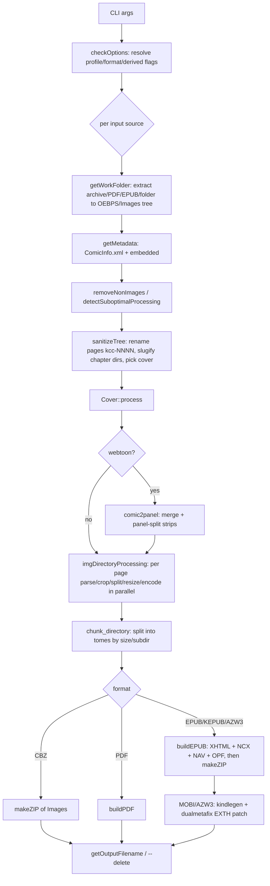

# AGENTS.md — Porting KCC's comic-to-ebook CLI to Rust (`comic-book ebook`)

This document is the game plan for porting the **command-line** comic→ebook converter from
KCC (Kindle Comic Converter, the Python project under `kcc/`) into this Rust workspace as a
new subcommand: **`comic-book ebook`**.

It is written to be executed incrementally by coding agents. Each phase has a concrete
deliverable and exit criteria. Keep this file updated as decisions are made.

---

## 1. Objective

Add a self-contained, cross-platform `comic-book ebook` command that converts comic book
archives into e-book formats:

- **Inputs:** `.cbz`/`.zip`, `.cbr`/`.rar`, `.cb7`/`.7z`, `.cbt`/`.tar`, image folders,
  and (secondary) `.epub` and `.pdf`.
- **Outputs:** `epub`, `kepub` (Kobo `.kepub.epub`), `azw3` / `mobi` (Kindle), plus
  `cbz`, `pdf`, and `kfx`-as-EPUB presets.
- **No external programs required.** No `7z`, `unrar`, `unar`, `kindlegen`, `mozjpeg`,
  ImageMagick, etc. Everything must be compiled into the binary (native Rust crates, or
  crates that vendor/compile their C dependencies).
- **No GUI, no Kindle-device detection/upload.**

The Python code is a **guide, not a specification**. Where Rust offers a materially better
approach for memory, CPU, or I/O, take it (see §5). Where KCC's *output document format* is
device-sensitive, reproduce it faithfully (see §5.2).

---

## 2. Scope

### In scope
- `kcc/kcc-c2e.py` pipeline and the modules it uses:
  `comic2ebook.py`, `comicarchive.py`, `image.py`, `color.py`, `page_number_crop_alg.py`,
  `inter_panel_crop_alg.py`, `common_crop.py`, `rainbow_artifacts_eraser.py`,
  `metadata.py`, `shared.py`, `comic2panel.py`, `pdfjpgextract.py`, `kindle.py` (device I/O
  excluded), `dualmetafix.py` (replaced — see §9).
- All `kcc-c2e` CLI options, re-expressed as `comic-book ebook` flags (§4).
- All output formats listed above.
- Feature fusion, multi-tome splitting, webtoon, panel view, smart cover crop, cropping,
  autocontrast/autolevel, moiré eraser, metadata via `ComicInfo.xml`.

### Out of scope
- `kcc.py`, `KCC_gui.py`, `KCC_ui*.py`, `KCC_rc.py`, `KCC_spread_label.py` (Qt GUI).
- `startup.py` GUI/dependency checks.
- Kindle device mounting, thumbnail upload (`kindle.py` device paths), `sent to Kindle`.
- Running/reading requiring `kindlegen`, `7`-Zip, `unar`, `unrar`, PyMuPDF, Pillow, numpy, Qt.
- `kcc-c2p.py` as a standalone command (its `comic2panel` logic is folded into `--webtoon`).

---

## 3. Reference: how KCC's `c2e` pipeline works

Read `kcc/kindlecomicconverter/comic2ebook.py` alongside this section.



Key behaviors to preserve (details in later sections):

- Work happens in a temp dir laid out as `<tmp>/OEBPS/Images/<chapter>/<page>`.
- Pages are renamed to `kcc-0001.ext` … (`sanitizeTree`), with an order suffix
  `-kcc-x` (normal), `-kcc-a`/`-kcc-d` (rotated spreads), `-kcc-b`/`-kcc-c` (split
  halves). Kindle Scribe output splits tall pages into `…-above`/`…-below`.
- Chapter directory names are slugified (ASCII, zero-padded numbers) for EPUB.
- Cover is either the first page, a `Covers/` sibling image, or a fused cover; optionally
  auto-cropped from a wide spread (`smartcovercrop`).
- Processing is parallel (Python `multiprocessing`), then the whole thing is zipped
  (`mimetype` first + stored, rest deflated) for EPUB.
- Default profile `KV`; default format `Auto` (→ MOBI for Kindle profiles, PDF for
  reMarkable, else EPUB).

### 3.1 Component → responsibility map

| KCC module | Responsibility | Rust home (§6) |
|:---|:---|:---|
| `comic2ebook.py` | Orchestration, CLI, EPUB/PDF building, chunking, fusion | `ebook/mod.rs`, `ebook/cli.rs`, `ebook/output/*`, `ebook/chunk.rs` |
| `comicarchive.py` | Archive detection/extraction via external tools | replaced by `crate::archive` (`ebook/input/archive.rs`) |
| `image.py` | `ProfileData`, `ComicPageParser`, `ComicPage`, `Cover` | `ebook/profiles.rs`, `ebook/processing/*` |
| `color.py` | Color vs. grayscale decision | `ebook/processing/color.rs` |
| `page_number_crop_alg.py` | Margin + page-number crop bbox | `ebook/processing/crop.rs` |
| `inter_panel_crop_alg.py` | Crop empty gutters between panels | `ebook/processing/interpanel.rs` |
| `common_crop.py` | Threshold/grouping helpers | `ebook/processing/crop.rs` |
| `rainbow_artifacts_eraser.py` | Moiré removal via FFT (color e-ink) | `ebook/processing/rainbow.rs` |
| `metadata.py` | `ComicInfo.xml` parse/write | `ebook/metadata.rs` |
| `shared.py` | Image ext helper, natural sort, tree walk | `ebook/model.rs`, `crate` utils |
| `comic2panel.py` | Webtoon merge + panel splitting | `ebook/processing/webtoon.rs` |
| `pdfjpgextract.py` | Legacy JPEG-in-PDF extraction | `ebook/input/pdf.rs` |
| `dualmetafix.py` | Patch MOBI EXTH (EBOK/ASIN) | replaced by `kindling` (§9) |
| `kindle.py` | Device detection/upload | **excluded** |

---

## 4. Target CLI

### 4.1 Shape

```text
comic-book ebook [OPTIONS] <INPUT>...

Inputs:
  One or more comic archives (.cbz/.cbr/.cb7/.cbt/.zip/.rar/.7z/.tar), image folders,
  or (secondary) .epub/.pdf files. A folder containing comics is expanded.
```

`clap` derive with grouped `#[command(flatten)]` structs mirroring KCC's option groups:
**Device**, **Main**, **Processing**, **Output**, **Custom profile**.

### 4.2 Option map (`kcc-c2e` → `comic-book ebook`)

Rename for clarity; keep semantics. Grouped to match KCC's parser groups.

**Device / Profile**
| KCC flag | New flag | Notes |
|:---|:---|:---|
| `-p/--profile` | `-p/--profile` | default `KV`; see §12.1 |
| `--customwidth` | `--custom-width` | override profile width |
| `--customheight` | `--custom-height` | override profile height |

**Main**
| KCC flag | New flag | Notes |
|:---|:---|:---|
| `-m/--manga-style` | `-m/--manga` | RTL reading/splitting |
| `--lightnovel` | `--light-novel` | resize only, preserve structure, output CBZ/EPUB |
| `--wallpaper` | `--wallpaper` | crop to fill screen |
| `--invertdirection` | `--invert-direction` | invert page-turn direction |
| `-q/--hq` | `-q/--hq` | higher-res panel view |
| `-2/--two-panel` | `-2/--two-panel` | 2-panel (not 4) panel view |
| `--vertical4panel` | `--vertical-4-panel` | side panels first |
| `--legacypanelview` | `--legacy-panel-view` | legacy panel view |
| `-w/--webtoon` | `-w/--webtoon` | webtoon mode |
| `--ts/--targetsize` | `--target-size <MB>` | max output size |
| `--filefusion` | `--file-fusion` | combine inputs into one book |

**Processing**
| KCC flag | New flag | Notes |
|:---|:---|:---|
| `-n/--noprocessing` | `-n/--no-processing` | pass pages through untouched |
| `-r/--splitter` | `-r/--splitter <0\|1\|2>` | 0 split, 1 rotate, 2 both |
| `-g/--gamma` | `-g/--gamma <float>` | gamma correction (auto when 0) |
| `-c/--cropping` | `-c/--cropping <0\|1\|2>` | 0 off, 1 margins, 2 margins+page numbers |
| `--cp/--croppingpower` | `--cropping-power <float>` | |
| `--cm/--croppingminimum` | `--cropping-minimum <float>` | |
| `--preservemargin` | `--preserve-margin <int>` | |
| `--ipc/--interpanelcrop` | `--inter-panel-crop <0\|1\|2>` | |
| `--blackborders`/`--whiteborders` | `--black-borders`/`--white-borders` | |
| `--forcecolor` | `--force-color` | do not grayscale |
| `--forcepng` | `--force-png` | PNG for B/W pages |
| `--force-png-rgb` | `--force-png-rgb` | color pages as PNG |
| `--webp` | `--webp` | lossy/lossless WebP output |
| `--noquantize` | `--no-quantize` | |
| `--pnglegacy` | `--png-legacy` | 8-bit PNG (legacy devices) |
| `--jpeg-quality` | `--jpeg-quality <0-95>` | default 85 (90 for KS/KCS) |
| `--maximizestrips` | `--maximize-strips` | 1×4 → 2×2 strips |
| `--autolevel` | `--auto-level` | |
| `--noautocontrast` | `--no-autocontrast` | |
| `--colorautocontrast` | `--color-autocontrast` | |
| `--eraserainbow` | `--erase-rainbow` | moiré filter |
| `--smartcovercrop` | `--smart-cover-crop` | |
| `--coverfill` | `--cover-fill` | crop cover to fill |
| `-u/--upscale` | `-u/--upscale` | |
| `-s/--stretch` | `-s/--stretch` | |
| `--norotate` | `--no-rotate` | |
| `--rotateright` | `--rotate-right` | |
| `--rotatefirst` | `--rotate-first` | |
| `--legacyextract` | `--legacy-extract` | PDF/EPUB legacy image extraction |
| `--pdfwidth` | `--pdf-width` | render vector PDFs to width |
| `-d/--delete` | `-d/--delete` | delete source after success |
| `--tempdir` | `--temp-dir` | spool temp files on source drive |
| `--mozjpeg` | *(dropped or mapped)* | optional; see §7 |

**Output**
| KCC flag | New flag | Notes |
|:---|:---|:---|
| `-o/--output` | `-o/--output <path>` | output dir or filename |
| `-t/--title` | `-t/--title <str>` | default = source name |
| `--metadatatitle` | `--metadata-title <0\|1\|2>` | |
| `--keepcomicinfo` | `--keep-comicinfo` | keep original ComicInfo.xml (CBZ) |
| `-a/--author` | `-a/--author <str>` | default = ComicInfo / `KCC` |
| `--language` | `--language <bcp47>` | default `en-US` |
| `-f/--format` | `-f/--format <FMT>` | see §4.3 |
| `--nokepub` | `--no-kepub` | `.epub` instead of `.kepub.epub` |
| `-b/--batchsplit` | `-b/--batch-split <0\|1\|2>` | |
| `--spreadshift` | `--spread-shift` | |
| `--onepagelandscape` | `--one-page-landscape` | |
| `--ebok` | `--doc-type <ebok\|pdoc\|none>` | replaces `--ebok` boolean; see §9 |

**Other**
| KCC flag | New flag |
|:---|:---|
| `-h/--help` | `-h/--help` (clap) |

### 4.3 Formats

`-f/--format` value set (KCC's, minus device-only behaviors):

| Value | Meaning |
|:---|:---|
| `auto` | pick by profile (MOBI for Kindle, PDF for reMarkable, else EPUB) |
| `epub` | fixed-layout EPUB 3 |
| `kepub` | KePub (EPUB with `.kepub.epub` + Kobo spread properties) |
| `azw3` | KF8-only Kindle file |
| `mobi` | dual MOBI7+KF8 `.mobi` (legacy devices) |
| `mobi+epub` | keep the intermediate EPUB alongside the MOBI |
| `cbz` | repackage images (no EPUB) |
| `pdf` | PDF |
| `kfx` | EPub preset for Calibre KFX Output plugin (KCC behavior) |
| `epub-200mb` / `pdf-200mb` / `mobi+epub-200mb` | size-capped presets (→ target_size 195 MB, batch split) |

---

## 5. Design decisions and deviations from KCC

### 5.1 Implementation optimizations (do these)

1. **No double temp tree.** KCC extracts to `<tmp>/OEBPS/Images`, copies again for fusion,
   and uses `multiprocessing` (pickling options per task). Design the Rust pipeline around
   an in-memory `ComicTree` (chapters → pages), streaming from the source archive.
   - Default: keep decoded/processed pages in memory with a configurable spool fallback
     (`--temp-dir`, or automatic spill above a byte budget).
   - This removes at minimum one full copy of every page image.
2. **Parallelism via `rayon`** over pages (CPU-bound image work), with a bounded pool sized
   to cores. No process spawning, no pickling.
3. **Stream output.** Write the EPUB zip as pages finish: `mimetype` first (stored), then
   images, then derived XHTML/NCX/NAV/OPF once dimensions are known. Reuse one scratch
   buffer per worker.
4. **Reuse existing SIMD resizing** (`fast_image_resize`) and the existing archive
   reader/writer stack (`src/archive`) instead of shelling out.
5. **Skip work when possible:** `--no-processing` copies original bytes; already-small
   images skip resampling; a page within the target profile that needs no transform and no
   format change is emitted byte-for-byte.
6. **Bound memory per page** and process chapter-by-chapter; never hold two full decode
   buffers plus an encode buffer unnecessarily (see §14).

### 5.2 Output fidelity (do NOT casually change)

The fixed-layout XHTML/OPF/NCX/NAV that KCC emits and the MOBI that `kindlegen` produced are
**device-sensitive**. Reproduce their *structure and semantics* (element names, attributes,
viewport meta, spread properties, EXTH/`doc-type` behavior). Optimize the *code that builds
them*, not the document format. Any intentional deviation must be called out and tested.

### 5.3 Dependencies instead of reimplementation where it is safer

- **MOBI/AZW3 encoding → `kindling-mobi`** (MIT, pure Rust, cross-platform, explicitly a
  kindlegen replacement with comic/fixed-layout support). Replaces `kindlegen` +
  `dualmetafix` + tool detection. **Decision (see §13.1/§13.2): `kindling` is an accepted
  hard dependency; we do not shell out to any external tool or sister binary.**
- **EPUB/KEPUB packaging** → hand-written to match KCC's layout (small, well-understood);
  do not pull a heavy EPUB framework unless it proves necessary.

### 5.4 Clean-room re-implementation of KCC behaviour (do NOT copy source)

KCC is distributed under ISC, but `image.py` and `dualmetafix.py` carry GPL-3 headers
(derived from earlier GPL sources), which is incompatible with this repo's MIT licence.
The corresponding behaviour will therefore be **re-implemented from scratch** from the
documented behaviour and observable outputs — never transliterated from KCC source:

- `image.py` → `ebook/processing/*` (`ComicPageParser`, `ComicPage`, `Cover`, and the crop/
  split/color/fill algorithms). Implement each algorithm from its spec (thresholds, order of
  operations, geometry) and validate against fixtures.
- `dualmetafix.py` → **not ported at all.** MOBI/AZW3 encoding *and* its EXTH/doc-type/ASIN
  handling are provided by the MIT `kindling` crate (§9).

Contributors must not paste GPL code, comments, or identifiers from those files into this
repo. When in doubt, write the implementation from the described behaviour and a test that
pins it.

---

## 6. Proposed Rust module architecture

```text
src/
  lib.rs                      # add `pub mod ebook;`
  cli.rs                      # add `Ebook { .. }` subcommand; dispatch to ebook::run
  ebook/
    mod.rs                    # run_ebook(); orchestration (makeBook equivalent)
    cli.rs                    # clap structs for all option groups
    options.rs                # resolved Options + checkOptions() equivalent
    profiles.rs               # ProfileData: Kindle/Kobo/reMarkable/OTHER + palettes
    model.rs                  # ComicTree, Chapter, Page, PageFlags, naming helpers
    metadata.rs               # ComicInfo.xml parse + metadata resolution
    naming.rs                 # slugify, sanitize/naming, getOutputFilename
    chunk.rs                  # target-size / batch-split tome keeper
    progress.rs               # indicatif reporting (headless-safe)
    input/
      mod.rs                  # ComicSource detection + dispatch
      archive.rs              # cbz/cbr/cb7/cbt/dir via crate::archive
      epub.rs                 # EPUB input (spine-ordered images)
      pdf.rs                  # PDF input (extract/render) + legacy JPEG scan
      fusion.rs               # --file-fusion
    processing/
      mod.rs                  # process tree in parallel; produce EncodedPage
      color.rs                # colorCheck
      fill.rs                 # fillCheck (page background)
      crop.rs                 # margins + page-number crop, threshold/group helpers
      interpanel.rs           # inter-panel crop
      rainbow.rs              # FFT moiré eraser
      page.rs                 # ComicPage: gamma/autocontrast/autolevel/resize/encode
      cover.rs                # Cover: process, smart cover crop, tome label
      webtoon.rs              # comic2panel: merge + panel split
    output/
      mod.rs                  # dispatch by Format; filename resolution; --delete
      epub/
        mod.rs                # buildEPUB driver
        xhtml.rs              # buildHTML (+ Panel View)
        nav.rs                # buildNCX / buildNAV
        opf.rs                # buildOPF (spread logic, kindle meta)
        package.rs            # OEBPS layout + EPUB zip (mimetype first)
      kepub.rs                # KEPUB variant (extension + Kobo properties)
      cbz.rs                  # CBZ output (reuse archive writer)
      pdf.rs                  # buildPDF
      kindle.rs               # kindling integration: azw3 / mobi / mobi+epub
```

Reuse (no change): `crate::archive` (`detect_archive_kind`, `ArchiveReader`,
`ArchiveWriter`), `crate::image_ops` (resize/encode helpers), `crate::clamp` patterns
(`remove_dir_all_force`).

---

## 7. Dependencies

Existing (reuse): `clap`, `clap_complete`, `image`, `zip`, `tar`, `sevenz-rust2`, `unrar`,
`rars`, `rayon`, `indicatif`, `natord`, `anyhow`, `tempfile`, `fast_image_resize`, `webp`,
`walkdir`, `same-file`, `infer`.

Add (verify licenses; prefer pure Rust):

| Crate | Purpose | License note |
|:---|:---|:---|
| `kindling-mobi` (lib `kindling`) | EPUB/OPF → AZW3/MOBI | MIT (compatible) |
| `quick-xml` | ComicInfo/EPUB/OPF parse + write | MIT/Apache |
| `uuid` | EPUB `dc:identifier` urn:uuid | MIT/Apache |
| `time` or `chrono` | `dcterms:modified` timestamp | MIT/Apache |
| `ndarray` | array math for crop/webtoon | MIT/Apache |
| `imageproc` | grayscale/box-blur/edges/draw text | MIT |
| `rustfft` | moiré FFT (`rainbow_artifacts_eraser`) | MIT/Apache |
| `ab_glyph` (via imageproc) | tome-number cover text | MIT/Apache |
| `slug` or small custom fn | chapter slugify parity with python-slugify | MIT/Apache |
| `lopdf` and/or `pdf-render`/`pdfboss-render` | PDF input (extract/render), pure Rust | verify |
| `printpdf` or `pdf-writer` | PDF output | MIT |
| `flate2` | EPUB deflate (likely already transitive) | MIT/Apache |

Avoid: `boko` (GPL-3.0-or-later — incompatible with this MIT project's dependency policy),
`pdfium-render`/`mupdf` unless a bundled build is acceptable (they pull platform binaries).
`--mozjpeg`: either drop, or use a pure-Rust/`mozjpeg` crate; default to the `image` JPEG
encoder with `--jpeg-quality`.

**Licence — decided (§13.1).** The KCC repo is distributed under ISC (`kcc/LICENSE.txt`),
but `kcc/kindlecomicconverter/image.py` and `dualmetafix.py` retain GPL-3 headers (they
derive from earlier GPL sources). `image.py` is the source of `ComicPage`/`Cover`.
Resolution: **clean-room re-implement** the behaviour with no source copied (see §5.4), and
use the MIT `kindling` crate for the MOBI side so `dualmetafix` is never ported. Do **not**
transliterate GPL source.

---

## 8. Feature-by-feature port map

| KCC function | Rust approach | Priority |
|:---|:---|:---|
| `checkOptions` | `Options::resolve` — derive `iskindle`/`isKobo`, `kindle_azw3`, defaults, format presets, panel-view gating, webtoon mandate, custom profile | P0 |
| `getWorkFolder` | `input/*` adapters producing a `ComicTree` | P0 |
| `getMetadata` | `metadata.rs` — parse ComicInfo, title/authors/series resolution | P0 |
| `removeNonImages` | drop non-image pages while building the tree | P0 |
| `sanitizeTree` + `slugify` | `naming.rs` — deterministic page names, chapter slugs, cover pick | P0 |
| `ComicPageParser` | `processing/page.rs` + `color.rs` + `fill.rs` + `crop.rs` + `interpanel.rs` | P0 |
| `ComicPage` (gamma/contrast/level/grayscale/quantize/resize/encode) | `processing/page.rs` | P0 |
| `Cover` | `processing/cover.rs` | P0 |
| `buildHTML` | `output/epub/xhtml.rs` | P0 |
| `buildNCX`/`buildNAV` | `output/epub/nav.rs` | P0 |
| `buildOPF` | `output/epub/opf.rs` | P0 |
| `buildEPUB` | `output/epub/mod.rs` | P0 |
| `makeZIP` | `output/epub/package.rs` (+ existing `ArchiveWriter` for CBZ) | P0 |
| `getOutputFilename` | `naming.rs` (Kobo/`.kepub.epub`, `_kcc<N>` collision) | P0 |
| `detectSuboptimalProcessing` | `processing/mod.rs` warnings (already-processed; small images) | P1 |
| `chunk_directory`/`chunk_process`/`createNewTome` | `chunk.rs` | P1 |
| `makeFusion` | `input/fusion.rs` | P1 |
| `comic2panel.main` (webtoon) | `processing/webtoon.rs` | P1 |
| `color.py` | `processing/color.rs` | P0 |
| `page_number_crop_alg.py` | `processing/crop.rs` | P1 |
| `inter_panel_crop_alg.py` | `processing/interpanel.rs` | P2 |
| `rainbow_artifacts_eraser.py` | `processing/rainbow.rs` | P2 |
| `buildPDF` | `output/pdf.rs` | P2 |
| PDF input (`getWorkFolder` branch, `pdfjpgextract`) | `input/pdf.rs` | P1 (extract), P2 (render) |
| EPUB input branch | `input/epub.rs` | P1 |
| `makeMOBI`/`makeMOBIFix`/`dualmetafix` | `output/kindle.rs` via `kindling` | P1 |
| `lightnovel` path | `output/mod.rs` resize-and-repackage branch | P1 |
| `--wallpaper` | `processing/page.rs` (fit crop) | P1 |
| kindle device upload | **excluded** | — |

---

## 9. Kindle output plan (AZW3/MOBI) without kindlegen

KCC's MOBI path = build fixed-layout EPUB → run `kindlegen` → `dualmetafix` patches EXTH
(`501`=EBOK/PDOC, `113`=ASIN). We replace all of that with **`kindling`**.

> **Decision (§13.2):** `kindling-mobi` is an accepted dependency. It is MIT-licensed and
> pure Rust, so it satisfies the "no external programs" rule and does not introduce a GPL
> obligation. `dualmetafix` is therefore **not ported** (see §5.4).

1. Build the same fixed-layout EPUB we would for `-f epub`.
2. Call `kindling`'s library API to encode:
   - `azw3` → KF8-only `.azw3` (default; modern Kindles).
   - `mobi` → legacy dual MOBI7+KF8 `.mobi` (for old devices + sideloaded library covers).
3. Map `--doc-type ebok|pdoc|none` onto kindling's `doc-type` (default `none` to avoid the
   documented firmware "back-to-library" issue). Cover/thumbnail handled by kindling.
4. `mobi+epub` → keep the intermediate `.epub` as well.

Risks/verification: confirm the exact `kindling` public API (build from EPUB path or bytes),
fixed-layout handling, and whether it can consume our OPF metadata. If it cannot, fall back
to (a) driving it as a *bundled* library path only, or (b) a minimal native KF8 writer as a
last resort (large — treat as a stretch task, see §11.9).

KFX: KCC outputs an EPUB meant for Calibre's KFX plugin. Reproduce that preset (EPUB with
KFX-oriented flags) — no KFX encoder needed.

---

## 10. Data model

```rust
struct ComicTree { chapters: Vec<Chapter>, cover: Option<CoverSource> }
struct Chapter { name: String, pages: Vec<Page> }        // name = source dir (pre-slug)
struct Page {
    source_name: String,          // original archive entry / path
    rel_path: String,             // chapter-relative
    image: DynamicImage,          // decoded (dimensions + pixels)
    background: Background,       // White | Black
    flags: PageFlags,             // Rotated, BlackBackground, Above/Below, OrderClass
}
enum Background { White, Black }
enum OrderClass { Normal, RotateFirst, RotateLast, SplitLeft, SplitRight }
```

`processing` turns each `Page` into one or more `EncodedPage { name, bytes, width, height,
media_type, order_class, flags }`. The tree then feeds chunking and output builders.

Naming helper mirrors KCC suffixes: `-kcc-x`, `-kcc-a/-kcc-d`, `-kcc-b/-kcc-c`, and Scribe
`-above`/`-below` — these suffix strings are load-bearing for the OPF spread logic; keep them.

---

## 11. Algorithms to port (processing)

All operate on decoded RGB/RGBA/grayscale images.

1. **`colorCheck`** — convert to YCbCr, take Cb/Cr histograms, apply the cutoff/diff-threshold
   cascade `((0,0),22) → ((.2,.2),10) → ((3,3),4)`; shortcut for original mode `L`/`1`;
   always color in webtoon mode. `forcecolor` changes the precision test.
2. **`fillCheck`** — threshold ≤128 → 1-bit; compare black/white `getbbox` surface areas;
   if close, sample 5-px rows/columns via histogram to decide `white`/`black`. Returns page
   background; overridable by `--black-borders`/`--white-borders`.
3. **`splitCheck`** — decide `N` (normal), `R` (rotated spread), `S1`/`S2` (split halves)
   from aspect ratios vs. device ratio, `--splitter`, `--no-rotate`, `--rotate-right`,
   `--maximize-strips`, webtoon. `BISECT_THRESHOLD = 1.8`; split when `w/h > 1.16`.
4. **Cropping** — `get_bbox_crop_margin[_page_number]`: grayscale, optional invert
   (non-white bg), autocontrast(1), box blur(1), threshold `240 - power*64`, ignore pixels
   near edges, then page-number detection via row grouping + box merging
   (`merge_boxes`, `group_close_values`). Cap crop to 10 % per side; respect
   `--preserve-margin` and `--cropping-minimum`.
5. **Inter-panel crop** — find empty rows/columns (not near borders), keep 4 % gutter,
   delete those rows/cols.
6. **`ComicPage` pipeline** — order per KCC: gamma → grayscale (if B/W) → autocontrast
   (`preserve_tone`, skip if low-contrast: `max-min < 159`) → `autolevel` if requested →
   resize → moiré erase → quantize/convert → encode. Resize uses `contain`/`fit`/`pad`
   semantics with `BICUBIC` when down-scaling within profile and `LANCZOS` otherwise; KFX
   resolution handling; `stretch`/`wallpaper`/`upscale` paths.
7. **Encoding** — JPEG (quality), PNG (`forcepng`, lossless 1-bit-ish), GIF
   (Kindle Scribe B/W), WebP (`--webp`), with the same branch order as `save_with_codec`.
   Media types in OPF must match (`image/jpeg|png|gif|webp`).
8. **`Cover`** — autocontrast, optional grayscale, `smartcovercrop` (wide-spread heuristics),
   `thumbnail`/`fit` to profile, optional tome label `N/M` text (stroke width 25, size h/7).
9. **Webtoon (`comic2panel`)** — merge chapter images vertically, detect panels via
   `FIND_EDGES` + threshold >6 + solid-row scanning, split over-long panels with overlap,
   repack into virtual pages at the device width/height (max width 1072).
10. **Moiré eraser** — RGB→YUV, FFT the luminance (`rustfft`), attenuate diagonal
    frequencies ≥0.30 cycles/px around 135°±10° (and perpendicular) by 0.10, inverse FFT,
    clip. Grayscale path operates on `L` directly.

---

## 12. Output document specs to reproduce

### 12.1 Profiles
Port the `ProfileData` tables verbatim (name, `(w,h)`, palette, gamma):
- **Kindle PDOC:** K1, K2, KDX, K34, K57, KPW, KV, KPW34, K810, KO, K11, KPW5, KPW6,
  KS1860, KS1920, KS1240, KS1324, KS, KCS, KS3, KSCS.
- **Kobo:** KoMT … KoE.
- **reMarkable:** Rmk1, Rmk2, RmkPP, RmkPPMove.
- **OTHER:** `(0,0)`.
- Palettes `Palette4/15/16`, `PalleteNull`.
`iskindle` = profile ∈ Kindle set; else `isKobo`. `KDX`+CBZ raises height to 1200;
Kindle Scribe caps width at 1920.

### 12.2 EPUB
Reproduce KCC's layout:
```
mimetype                     (stored, first)
META-INF/container.xml
OEBPS/Text/style.css
OEBPS/Text/**/*.xhtml        (one per page; Panel View divs when enabled)
OEBPS/Images/**              (cover.jpg + page images, chapters preserved)
OEBPS/toc.ncx
OEBPS/nav.xhtml
OEBPS/content.opf
```
- XHTML: `<!DOCTYPE html>`, `viewport` meta with width/height (÷1.5 when `--hq`), `img`
  with absolute `width`/`height`, `../` backrefs computed from the `Images` depth,
  `display:none` div for Kindle panel mode, and the `PV-*` panel-view divs.
- OPF: `package version="3.0"`, Dublin Core metadata, `dc:contributor` `KindleComicConverter-<ver>`,
  `belongs-to-collection`/`group-position` (series/volume/number, non-Kindle), `dcterms:modified`,
  `fixed-layout`/`original-resolution`/`book-type`/`primary-writing-mode`/`zero-gutter`/
  `zero-margin`/`ke-border-*`/`orientation-lock`/`region-mag` (Kindle), `rendition:spread`/
  `rendition:layout`, manifest items, and the `spine` with the spread-property algorithm
  (forward pass with `-kcc-a/b/c/d/x` specials, backward fix-up, `--spread-shift`,
  `--one-page-landscape`, `page-progression-direction`).
- `nav.xhtml` with `epub:type="toc"` and `page-list`.
- KEPUB: same, but extension `.kepub.epub` and `rendition:page-spread-*` properties
  (`isKobo` branch of `pageSpreadProperty`).

### 12.3 CBZ / PDF / light-novel
- CBZ: zip the processed `Images` tree; optionally keep `ComicInfo.xml`; cover as `##cover.jpg`
  when smart/custom cover applies.
- PDF: one page per image at native size, streamed, with title/author metadata.
- Light novel: resize-only, preserve structure, output CBZ (or EPUB passthrough).

---

## 13. Decisions and open questions

The two most consequential items are now **resolved** (§13.1). The rest remain open (§13.2).

### 13.1 Resolved

1. **Licence of `image.py`/`dualmetafix.py` (GPL-3 headers) vs. this repo's MIT — RESOLVED:
   clean-room.** The image-processing and MOBI-metadata behaviour will be **re-implemented
   from scratch** from documented behaviour and observable outputs, without transliterating
   KCC's `image.py` or `dualmetafix.py` source (see §5.4). MOBI/AZW3 encoding is handled by
   the MIT `kindling` crate, so `dualmetafix` is not ported at all. Contributors must not
   copy GPL code into this repo.
2. **`kindling` as a dependency — RESOLVED: adopt it.** `kindling-mobi` (MIT, pure Rust) is
   an accepted hard dependency for AZW3/MOBI output (§9). No sister tool and no subprocess;
   it is compiled into the binary.

### 13.2 Still open

3. **PDF input depth.** Start with embedded-JPEG extraction (pure Rust); decide whether to
   add a pure-Rust rasterizer for vector PDFs.
4. **Memory policy.** Default in-memory vs. spool-to-temp for large inputs; choose the
   spill budget and flag.
5. **`--mozjpeg`.** Drop or provide an equivalent; recommend drop with a clear message.
6. **KFX.** Confirm "EPUB preset only" (KCC behavior) is acceptable.
7. **Option naming.** Confirm the snake-case renames in §4.2, or preserve KCC spellings.
8. **Parity testing.** Approve committing KCC-generated reference EPUBs (from our own test
   content) for byte/structure comparison, or restrict to structural assertions.

---

## 14. Performance & memory goals

- Convert a 200-page CBZ to EPUB in single-digit seconds on a modern laptop (CPU-bound,
  rayon-parallel), comparable to or better than `kindling`'s claimed ~3 s.
- Peak RSS bounded by `O(cores × page_buffer)` + spooled output, not by total book size in
  the default path; spool to temp when the encoded output exceeds a budget.
- No process spawning for image work; no temp tree in the common case.
- Zero external process invocations at runtime.

---

## 15. Execution plan (phases)

Each phase ends with `cargo fmt`, `cargo clippy --all-targets --all-features -D warnings`,
and `cargo test` green on the CI matrix.

### Phase 0 — Scaffolding
- Add `ebook` subcommand to `src/cli.rs` and `pub mod ebook;` to `src/lib.rs`.
- Skeleton modules per §6 with `Options`, `Format`, `Profile`, `ProfileTable`.
- Error type/exit-code conventions; progress scaffolding (`indicatif`, headless-safe).
- **Exit:** `comic-book ebook --help` and `--version` work; `--format`/`--profile` parse.

### Phase 1 — Input adapters + model
- `ComicTree`/`Chapter`/`Page`; archive adapter over `crate::archive` preserving chapters.
- ComicInfo discovery; natural sort of pages/chapters.
- **Exit:** a fixture CBZ/CBR/CB7/CBT/folder all load into an identical tree with correct
  page order and chapter structure.

### Phase 2 — Core image pipeline (B/W + color, no crop)
- `colorCheck`, `fillCheck`, `splitCheck`, gamma, autocontrast, autolevel, grayscale,
  quantize, resize, encode (JPEG/PNG/WebP/GIF).
- Parallel processing with rayon.
- **Exit:** unit tests for each algorithm + snapshot of output image dimensions/flags for a
  fixture book.

### Phase 3 — Cropping & enhancement
- Margin/page-number crop, inter-panel crop, preserve-margin/minimum, moiré eraser,
  `--wallpaper`/`--stretch`/`--upscale`, `--maximize-strips`.
- **Exit:** crop bboxes match reference values on committed fixtures.

### Phase 4 — Metadata & naming
- ComicInfo parse → title/authors/series/volume/number/summary/bookmarks; `--metadata-title`;
  naming/slugify; output filename resolution incl. KEPUB and `_kcc<N>` collisions; cover pick
  incl. `Covers/`.
- **Exit:** metadata unit tests; filename tests for all formats.

### Phase 5 — EPUB/KEPUB (first shippable output)
- XHTML, NCX, NAV, OPF (incl. spread algorithm), container, style, panel-view markup, zip
  packaging (mimetype first/stored).
- **Exit:** fixture book converts to a structurally valid EPUB (parse back and assert
  container → OPF → spine → XHTML → image references); optional `epubcheck` job (ignored by
  default).
- **Milestone: `comic-book ebook -f epub <cbz>` usable.**

### Phase 6 — Cover, panel view, Scribe strips, spread options
- `Cover::process` + smart crop + tome label; panel-view variants
  (`-2`, `--vertical-4-panel`, `--legacy-panel-view`, `-q`); Scribe `above`/`below`;
  `--spread-shift`, `--one-page-landscape`, `--invert-direction`.
- **Exit:** OPF spine/spread assertions across RTL/LTR/shift/one-page cases.

### Phase 7 — CBZ, PDF, light-novel
- CBZ output + `--keep-comicinfo`; PDF output; light-novel mode.
- **Exit:** round-trip tests (CBZ loads back; PDF has N pages of correct size).

### Phase 8 — Kindle output (AZW3/MOBI) via kindling
- Build fixed-layout EPUB → `kindling` → `.azw3` / `.mobi`; `--doc-type`;
  `mobi+epub`; `-f auto` for Kindle profiles.
- **Exit:** structural readback of produced AZW3/MOBI (or `kindling dump`) + integration test.

### Phase 9 — Chunking, fusion, delete
- `--target-size`, `--batch-split`, tome titles `[i/n]`, `--file-fusion` (+ `Covers/` fused
  cover), `--delete`, `--temp-dir`.
- **Exit:** multi-tome output splits at the size boundary; fusion merges and orders inputs.

### Phase 10 — Webtoon
- Port `comic2panel`: merge + panel detection + overlap splitting + virtual pages.
- **Exit:** webtoon fixture produces expected page count and split points.

### Phase 11 — PDF/EPUB input, polish
- PDF input (extract, optional render), EPUB input (spine order), legacy extract,
  `--pdf-width`; `detectSuboptimalProcessing` warnings; completions/docs; README section.
- **Exit:** all input kinds covered; warnings match KCC semantics.

### Phase 12 — Hardening
- Fuzz/robustness on malformed archives; large-book memory test; cross-platform verification;
  update README and this document; bump version.

---

## 16. Testing & validation strategy

- **Unit tests** per algorithm with small synthetic images (color check decisions, fill
  detection, split classification, crop bboxes, slugify, spread properties, filename logic,
  OPF/NCX/NAV serialization).
- **Fixture/golden tests** (like `kindling`'s approach): commit small CBZ/CBR/CB7/CBT inputs
  and assert output structure by parsing it back (mimetype first + stored; OPF spine;
  XHTML image refs; image byte dimensions). Optionally commit KCC-generated reference EPUBs
  (from our own content) for structural diffing (pending §13.2 item 8).
- **Round-trip tests:** CBZ→CBZ, EPUB→input→EPUB where applicable.
- **EPUB conformance:** opt-in `epubcheck` job (JVM), marked `#[ignore]` by default.
- **AZW3/MOBI:** structural readback; if feasible, decode with a reader or compare against a
  committed `kindlegen` reference (note legal caveats — commit only outputs, never binaries).
- **Cross-platform CI:** reuse the existing `ubuntu`/`macos`/`windows` matrix; add a release
  job for static musl Linux if AZW3 deps permit.
- **Silence progress bars in tests** (reuse `tests/common/mod.rs` pattern).

---

## 17. Cross-platform & packaging notes

- All new behavior must compile on Linux, macOS, and Windows. Prefer pure-Rust crates;
  `unrar` and `webp` vendor/compile their C sources (acceptable, no external programs).
- Keep paths OS-agnostic; use `std::path`; guard Windows path-length concerns (KCC flattens
  at >220 chars — reproduce or improve with a deterministic short-name scheme).
- Respect Windows reserved characters in chapter/file names.
- Keep the existing `--completions` generator working with the new subcommand.

---

## 18. Risks & mitigations

| Risk | Impact | Mitigation |
|:---|:---|:---|
| `kindling` library API doesn't fit our EPUB | AZW3 blocked | `kindling` is an adopted dependency (§13.2). Verify its builder API with a Phase 0 spike; fallback: drive its comic pipeline directly, or (last resort) a minimal native KF8 writer |
| GPL headers in `image.py`/`dualmetafix.py` | Licensing | **Resolved (§13.1):** clean-room re-implementation from behaviour, no GPL code copied (§5.4); `dualmetafix` not ported, MOBI handled by MIT `kindling` |
| PDF rendering of vector PDFs | Feature gap | Start with embedded-image extraction; add pure-Rust rasterizer later |
| Fidelity drift in OPF/spread logic | Device breakage | Port the algorithm exactly; assert with tests; no casual "improvements" |
| Memory blow-up on huge books | OOM | Streaming + spool budget (§14) |
| Cropping/panel algorithms differ subtly | Visible artifacts | Fixture-based bbox/panel assertions; tune to match KCC outputs |
| New deps hurt musl static or Windows | Build/release | Prefer pure Rust; validate in CI matrix before committing to a dep |

---

## 19. Definition of done

- `comic-book ebook` converts `.cbz`, `.cbr`, `.cb7`, `.cbt`, folders (and `.epub`/`.pdf`)
  into `epub`, `kepub`, `azw3`, `mobi` (plus `cbz`, `pdf`, `kfx` preset).
- No external programs are invoked or required; works offline on all three OSes.
- The full option set in §4 is implemented with KCC-equivalent semantics.
- The vision in §1 (self-contained, cross-platform, no GUI/Kindle-device code) holds.
- Tests, clippy, fmt pass on CI; docs updated; this AGENTS.md kept current.

---

## 20. Appendix

### 20.1 Useful references
- `kcc/kindlecomicconverter/comic2ebook.py` — orchestration + output building.
- `kcc/kindlecomicconverter/image.py`, `color.py`, `page_number_crop_alg.py`,
  `inter_panel_crop_alg.py`, `common_crop.py`, `rainbow_artifacts_eraser.py`,
  `comic2panel.py`, `metadata.py`, `shared.py`.
- `src/archive/*` — existing Rust archive reader/writer to reuse.
- `src/image_ops.rs`, `src/clamp.rs` — existing resize/encode and parallel patterns.
- `kindling` (MIT) — native MOBI/AZW3 builder: <https://github.com/ciscoriordan/kindling>.
- MobileRead MOBI wiki — format background.

### 20.2 Glossary
- **CBZ/CBR/CB7/CBT** — ZIP/RAR/7-Zip/TAR comic archives.
- **KF8 / AZW3** — Kindle Format 8; `.azw3` is KF8-only.
- **KEPUB** — Kobo's EPUB dialect (`.kepub.epub`).
- **Panel View** — Kindle tap-to-zoom regions (`PV-*` divs + `app-amzn-magnify`).
- **Tome** — one output file when a source is split by size (`--target-size`/`--batch-split`).
- **Fusion** — combining multiple inputs into one book (`--file-fusion`).

### 20.3 Verified dependency research (checked against crates.io)

Recorded so implementation does not have to re-derive it. Re-verify versions at Phase 0,
but these are the candidates §7 depends on.

| Crate | Latest | License | Assessment |
|:---|:---|:---|:---|
| `kindling-mobi` (lib `kindling`) | 0.45.x | MIT | Pure Rust, static, edition 2024 (needs Rust ≥1.85). Drop-in kindlegen replacement. Its `build` consumes an EPUB/OPF (fixed-layout supported) and emits KF8-only `.azw3` by default or a dual MOBI7+KF8 `.mobi` with `--legacy-mobi`; `--doc-type` maps to our `--doc-type`. **This is the §9 integration point.** Note it also ships its own comic pipeline (`kindling comic`) — use only the *builder* so we keep our ported KCC pipeline in control. |
| `boko` | 0.5.x | **GPL-3.0-or-later** | EPUB/AZW3/KFX reader+writer, pure Rust. KFX/AZW3 **write** support would be valuable, but the GPL-3 license is incompatible with this repo's MIT policy — **do not depend on it** unless the project relicenses. |
| `epub3-kindle` | 0.4.x | verify | Alternative EPUB3→KF8/dual-MOBI converter if `kindling-mobi`'s API does not fit. |
| `mobi` | 0.8.0 | MIT/Apache | MOBI **reader** only (useful for structural readback tests, not encoding). |
| `pdfboss-render` | 2.11.x | verify | Pure-Rust PDF rasterize + embedded-image extract — candidate back end for vector PDF input (P2). |
| `pdf-render` | 1.0.0 | verify | Pure-Rust PDF rasterizer — alternate candidate. |
| `fop-pdf-renderer` / `fop-render` | 0.1.x | Apache-2.0 | Pure-Rust PDF-to-image (from Apache FOP port); lower maturity. |

Deliberately avoided: `pdfium-render`/`mupdf` (pull platform binaries — violates the
"self-contained, no external programs" rule), `boko` (GPL-3, see above), `mobi-sys`
(FFI to `libmobi`, a C dependency we do not need).

**Action for Phase 0 spike:** read `kindling`'s public API (`src/lib.rs`) and build a fixed-layout
EPUB from §12.2, then confirm it round-trips through `kindling` (or `kindling dump`) with our
OPF metadata intact before committing to the §9 plan.
