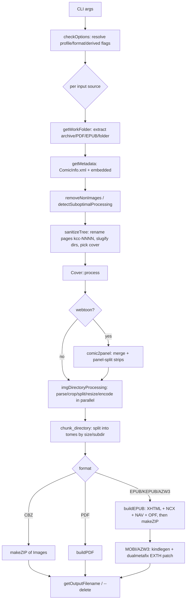

# Architecture

How KCC's `kcc-c2e` pipeline maps onto this crate.

## The reference pipeline

This section describes the behaviour the port reproduces, derived from studying KCC's
`kcc-c2e` pipeline.



Observable behaviours the port preserves:

- Pages are renamed `kcc-0001.ext`, … with an order suffix: `-kcc-x` (normal),
  `-kcc-a`/`-kcc-d` (rotated spreads), `-kcc-b`/`-kcc-c` (split halves). Kindle Scribe splits
  tall pages into `…-above`/`…-below`. **These suffixes are load-bearing for the OPF spine
  logic — keep them.**
- Chapter directory names are slugified to ASCII (zero-padded numbers).
- Cover selection: first page, a sibling `Covers/` image, or a fused cover; optionally
  auto-cropped from a wide spread (`--smart-cover-crop`).
- Processing is parallel; EPUB is packaged with `mimetype` first (stored).
- Default profile `KV`; default format `auto` (MOBI for Kindle profiles, PDF for reMarkable,
  otherwise EPUB).

## KCC module → Rust module

| KCC source | Responsibility | Rust home |
|:---|:---|:---|
| `comic2ebook.py` (`checkOptions`, `makeBook`, `buildEPUB`) | Orchestration, CLI, output building, chunking, fusion | `ebook/mod.rs`, `ebook/cli.rs`, `ebook/options.rs`, `ebook/output/*`, `ebook/chunk.rs` |
| `comicarchive.py` | Archive extraction | replaced by `crate::archive` (`ebook/input/archive.rs`) |
| `image.py`: `ProfileData` | Device profiles | `ebook/profiles.rs` |
| `image.py`: `ComicPageParser`, `ComicPage`, `Cover` | Per-page parse/transform/encode, cover | `ebook/processing/*` |
| `color.py` (`colorCheck`) | Colour vs. grayscale | `ebook/processing/color.rs` |
| `page_number_crop_alg.py`, `common_crop.py` | Margin + page-number crop | `ebook/processing/crop.rs` |
| `inter_panel_crop_alg.py` | Inter-panel gutter crop | `ebook/processing/interpanel.rs` |
| `rainbow_artifacts_eraser.py` | Moiré removal (FFT) | `ebook/processing/rainbow.rs` |
| `comic2panel.py` | Webtoon merge + panel splitting | `ebook/processing/webtoon.rs` |
| `metadata.py` | `ComicInfo.xml` parse/write | `ebook/metadata.rs` |
| `pdfjpgextract.py` | Legacy JPEG-in-PDF extraction | `ebook/input/pdf.rs` |
| `shared.py` | Image-extension helper, natural sort, tree walk | `ebook/model.rs`, `ebook/naming.rs`, `crate` utils |
| `kindle.py` | Device detection/upload | **excluded** |
| `dualmetafix.py` | Patch MOBI EXTH | replaced by `kindling` (see [output.md](output.md)) |

## Crate layout

```text
src/
  lib.rs, cli.rs               # root Cli; `ebook` subcommand dispatch
  archive/                     # archive reader/writer (reused)
  units.rs                     # zero-cost geometry/unit newtypes (Size, BBox, IndexBox, Range, ...)
  ebook/
    mod.rs                     # run_ebook(); orchestration (makeBook equivalent)
    cli.rs                     # clap structs for every option group
    options.rs                 # resolved Options + checkOptions equivalent
    profiles.rs                # Profile/ProfileData tables + palettes
    model.rs                   # ComicTree, Chapter, Page, PageFlags, ...
    metadata.rs                # ComicInfo.xml parse + metadata resolution
    naming.rs                  # slugify, sanitize/naming, getOutputFilename
    chunk.rs                   # target-size / batch-split tome keeper
    progress.rs                # indicatif reporting (overall + per-file, headless-safe)
    input/                     # archive / epub / pdf / fusion source adapters
    processing/                # color, fill, crop, interpanel, rainbow, page, cover, webtoon
    output/                    # epub (+ xhtml/opf/nav/package), kepub, cbz, pdf, lightnovel, kindle
templates/                     # askama skeletons for the generated EPUB documents
```

Reused unchanged: `crate::archive` (`ArchiveReader`/`ArchiveWriter`), `crate::image_ops`
(resize/encode helpers) and `crate::clamp` patterns. The generated document skeletons
(`page.xhtml`, `content.opf`, `toc.ncx`, `nav.xhtml`, `style.css`) live in the crate-root
`templates/` directory and are compiled into the binary via `askama`'s `path = "…"` — there is
no runtime template file.

## Data model

```rust
struct ComicTree { chapters: Vec<Chapter>, cover: Option<CoverSource>, comicinfo: Option<Vec<u8>> }
struct Chapter { name: String, pages: Vec<Page> }   // name = image-root-relative dir path ("" = root)
struct Page {
    source_name: String,         // book-relative source path (redundant root dir stripped)
    rel_path: String,            // chapter-relative file name
    image: Option<DynamicImage>, // decoded pixels, present only while processing
    dimensions: Size,            // header dimensions, available without decoding
    background: Background,      // detected page background (fill/crop decisions)
    flags: PageFlags,            // Orientation, ResolvedFill, ScribeHalf, OrderClass
    raw: Option<Vec<u8>>,        // original encoded bytes (lazy decode source, --no-processing)
    source_media_type: Option<MediaType>,
}
enum Background { White, Black }
struct ResolvedFill(Background)  // resolved --borders fill, distinct from Page::background
enum OrderClass { Normal, RotateFirst, RotateLast, SplitLeft, SplitRight }
enum Orientation { Upright, Rotated }
enum ScribeHalf { NotSplit, Above, Below }
enum MediaType { Jpeg, Png, Gif, WebP }

struct EncodedPage {            // one processed/encoded page (a spread can yield several)
    name: String,               // stem + `-kcc-<order>` + extension
    order_class: OrderClass,
    media_type: MediaType,
    bytes: Vec<u8>,
    size: Size,
    flags: PageFlags,
}
```

- `Size` and the other geometry/unit newtypes (`BBox`, `IndexBox`, `Range`, `Percent`, `Fraction`,
  `Pixels`, `Bytes`, `Megabytes`, `Quality`) live in [`units`](../../src/units.rs). They are `Copy`
  wrappers (`#[repr(transparent)]` where they wrap a single field), so a width can no longer be
  passed where a height is expected, and a byte cap can no longer be compared against a pixel
  count.

- `Chapter::name` is the directory path relative to the image root (`""`, `"Chapter 1"`,
  `"Chapter 1/Sub"`, …); each path component is slugified on output.
- `Page::source_name` is book-relative after an archive's single redundant root directory is
  stripped, so equivalent CBZ/folder inputs load identically.
- `Page::image` is `None` until the page is processed; `Page::raw` holds the encoded source
  bytes and `Page::dimensions` the header dimensions. A page may instead be *pixel-only*
  (`image` set, `raw` `None`) when it was synthesized by the webtoon merge.
- `processing` turns each `Page` into one or more `EncodedPage`s; the tree then feeds chunking
  and the output builders.

## Design principles

### In-memory, streamed processing

1. **Work in memory.** KCC extracts to a temp tree, copies again for fusion, and pickles
   options per `multiprocessing` task. This port builds one in-memory `ComicTree` and streams
   output from it, removing at least one full copy of every page.
2. **Decode lazily.** Ingest reads only each page's *header* (for its dimensions) and keeps the
   encoded bytes; the pixels are decoded on demand during processing and released as soon as the
   page has been encoded. A book therefore never holds its decoded pages at once — only the
   encoded source, the encoded output and one in-flight page per `rayon` worker (see
   [Performance & memory goals](#performance--memory-goals)).
3. **Parallelise with `rayon`** over pages (CPU-bound image work) — no subprocesses, no pickling.
4. **Stream output.** The EPUB zip is built as an ordered entry list: `mimetype` first
   (stored), then images, then the derived XHTML/NCX/NAV/OPF. The page images are borrowed by
   the entry list, so packaging does not duplicate the encoded book.
5. **Reuse** `fast_image_resize` (SIMD) and the existing `crate::archive` reader/writer rather
   than shelling out.
6. **Skip work when possible.** `--no-processing` copies original bytes and never decodes;
   already-small images skip resampling; a page needing no transform or format change is emitted
   byte-for-byte; a light-novel page that already fits is copied without decoding.

### Output fidelity

The fixed-layout XHTML/OPF/NCX/NAV and the MOBI container are **device-sensitive**. Reproduce
their structure and semantics (element/attribute names, viewport meta, spread properties,
EXTH/`doc-type` behaviour); optimise the code that builds them, not the documents themselves.
Every intentional deviation is listed in [porting.md](porting.md) and pinned by a test; the
document specs themselves are in [output.md](output.md).

### Performance & memory goals

- Convert a 200-page CBZ to EPUB in single-digit seconds on a modern laptop
  (`rayon`-parallel), comparable to or better than `kindling`'s claimed ~3 s.
- Peak RSS is **linear in the encoded book, not the decoded book**: ingest keeps each page's
  encoded bytes and header dimensions only, processing decodes one page per `rayon` worker and
  releases it immediately, and packaging borrows the encoded pages. Peak memory is therefore
  `(encoded source) + (encoded output) + (in-flight decoded pages)`, independent of the page
  count; `--no-processing` and light-novel pages that already fit are never decoded at all. The
  hardening memory test pins this (see [development.md](development.md)).
- No process spawning for image work and no temp tree in the common case — zero external
  process invocations at runtime (the Kindle path spools the intermediate EPUB to a scratch
  directory only because `kindling` reads it from disk).
